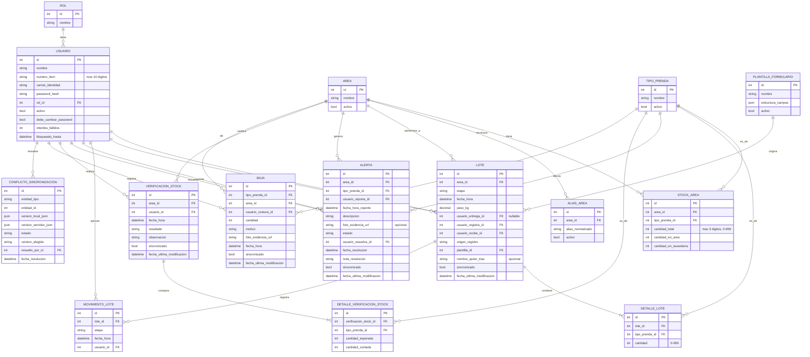
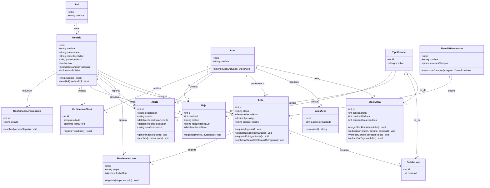
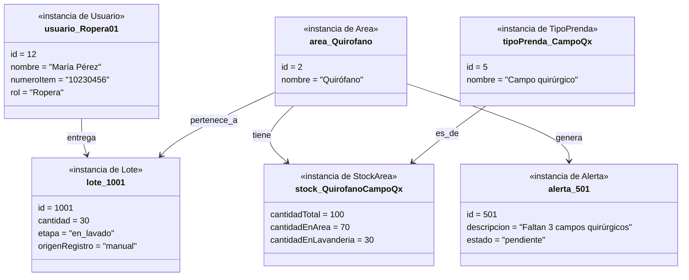
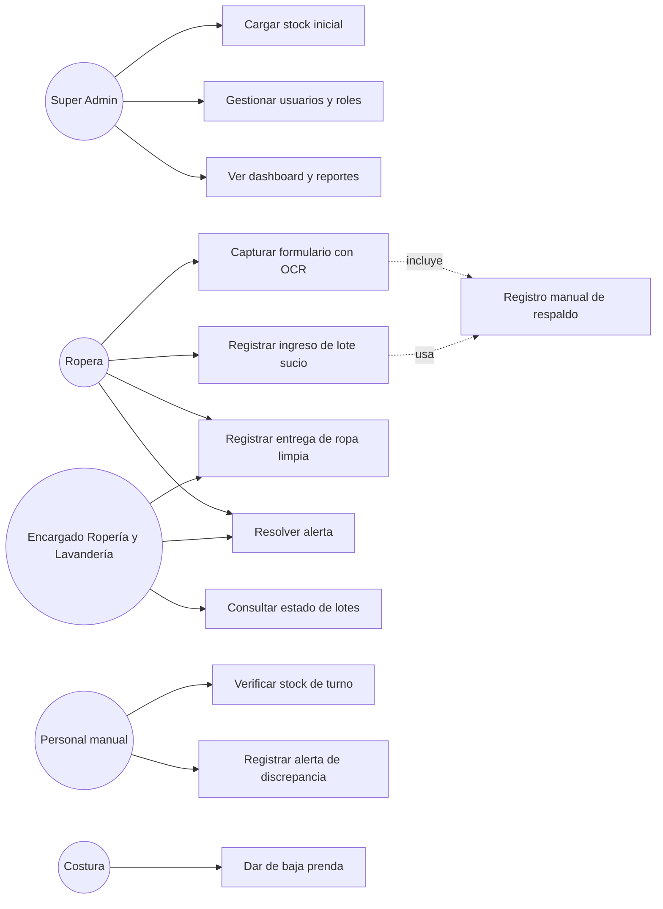
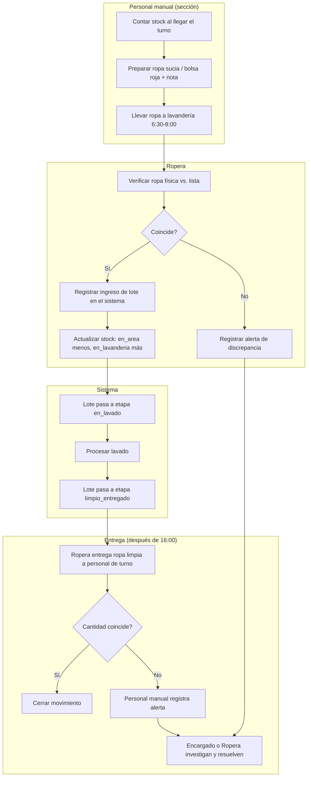
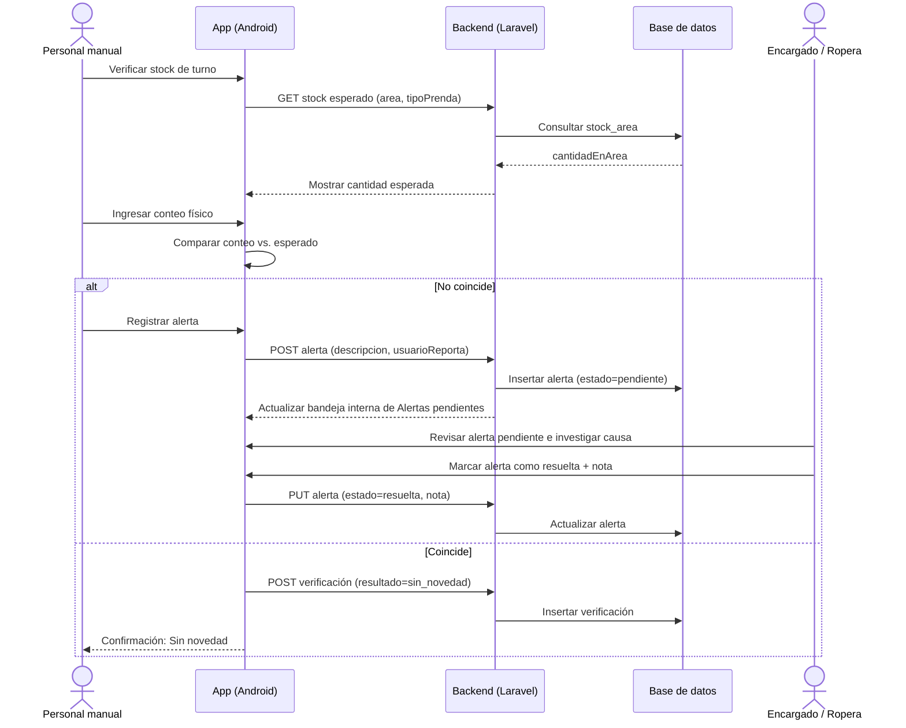
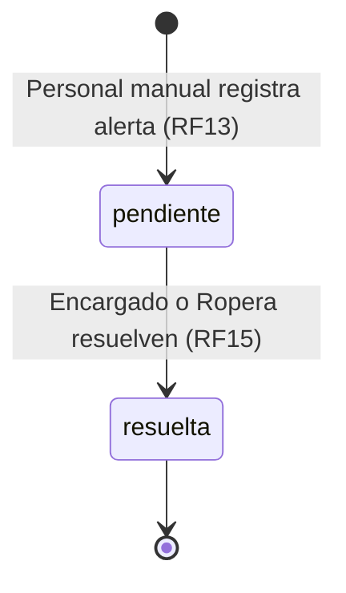
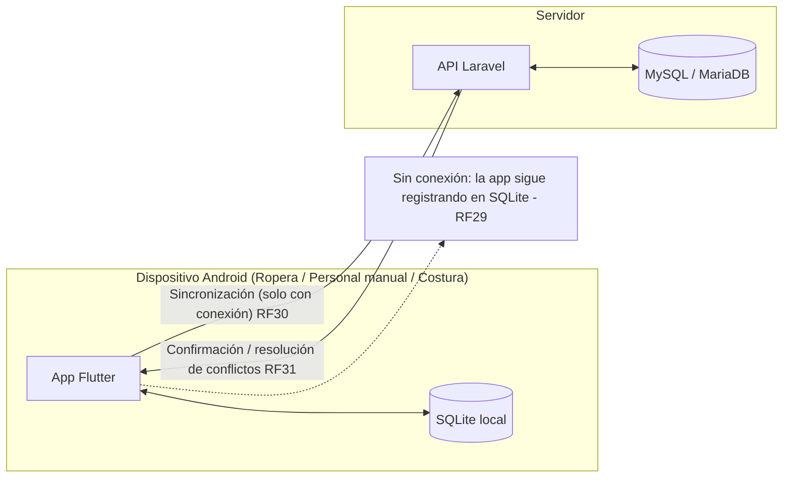
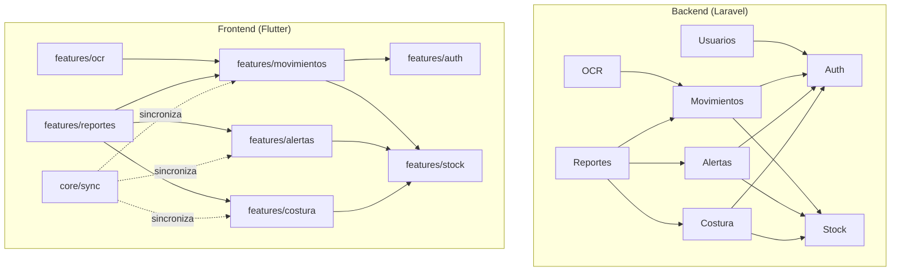

# DOCUMENTO MAESTRO DE REQUERIMIENTOS Y BACKLOG INICIAL

**SICOTRAZ** — Sistema de Control y Trazabilidad de Ropa Hospitalaria mediante OCR
Servicio de Ropería y Lavandería — Hospital de Tercer Nivel

Tecnológico Boliviano Alemán — T.S. Sistemas Informáticos
Documento único de referencia — base para diseño técnico, backlog Scrum y desarrollo
Cochabamba, agosto de 2026

> Este documento reemplaza a las versiones anteriores del ERS. A partir de aquí, cualquier cambio de alcance o de regla de negocio debe actualizarse **solo en este archivo**, para evitar tener información dispersa en varias versiones.

**Versión: 1.2 — Documento actualizado para entrega a desarrollo**
**Última actualización:** 29 de agosto de 2026

**Changelog resumido (cambios más relevantes hasta llegar a v1.2):**
- Corrección de áreas piloto: Cirugía Varones y Quirófano (reemplaza referencia anterior errónea de "4 áreas: Salas, Quirófano, Emergencias, UTI").
- Corrección de límite de cantidad de prendas: 3 dígitos / máximo 999 (reemplaza dato erróneo de 4 dígitos/9999).
- Corrección de longitud de número de ítem/contrato: máximo 10 dígitos en todos los casos.
- Las 21 pantallas de wireframes documentadas completas, incluyendo Home por rol.
- Diseño visual (paleta de colores, tipografía) definido sin depender de Figma.
- RF45 formalizado (reporte de ropa circulando, visible para Encargado y Super Admin).
- Criterios de aceptación consolidados para las 28 Historias de Usuario (antes solo 11 los tenían).
- Contrato de API (sección 27) agregado como referencia única para la comunicación Flutter ↔ Laravel.
- **(v1.1)** Sección 9 (sprints) formalizada: HU/RF exactos por sprint + Definition of Done específico por sprint. Seguimiento de avance se lleva en archivo aparte (`Seguimiento_Sprints_SICOTRAZ.md`), fuera de este documento.
- **(v1.2)** Quirófano registra normalmente 5–8 lotes diarios; solo sus lotes confirmados entre 06:30 y 16:30 pasan inmediatamente a `en_lavado`. Las demás áreas conservan su flujo anterior. La verificación de stock siempre se guarda y muestra “Sin novedad” o “Irregularidad reportada”.

---

## ÍNDICE

1. Propósito del documento
2. Actores del sistema
3. Flujo real del proceso
4. Formularios físicos existentes
5. Situación del inventario base
6. Requerimientos funcionales (RF)
7. Requerimientos no funcionales (RNF)
8. Backlog inicial — Épicas e Historias de Usuario
9. Orden de sprints propuesto
10. Glosario de términos del dominio
11. Diseño de interfaz (11.1 Wireframes en texto, 11.2 Diseño visual)
12. Pendientes antes de programar
13. Diseño de base de datos (modelo entidad-relación)
14. Plan de diagramas UML
15. Diagrama de clases
16. Diagrama de objetos
17. Diagrama de casos de uso
18. Diagrama de actividades
19. Diagrama de secuencia
20. Diagrama de estados
21. Diagrama de despliegue
22. Catálogo de reglas de negocio
23. Diagrama de paquetes
24. Arquitectura técnica
25. Plan de calidad (QA)
26. Normas de código y arquitectura (Clean Code)
27. Contrato de API (endpoints)
28. Siguiente paso técnico

---

## 1. Propósito del documento

**Nombre del proyecto: SICOTRAZ** (Sistema de Control y Trazabilidad de Ropa Hospitalaria).

Consolidar en un único lugar todas las reglas de negocio, actores, flujos y requerimientos del sistema, levantados directamente con el responsable del proyecto mediante entrevista estructurada. Sirve como base firme tanto para el diseño técnico (base de datos, UML) como para armar el backlog de Scrum, evitando retrabajo por falta de definición.

Se distingue siempre entre información **confirmada** y lo que aún debe **verificarse con el hospital**.

---

## 2. Actores del sistema

Todos los roles pertenecen al **Servicio de Ropería y Lavandería** (Costura incluido, no es un área administrativa aparte).

**Identificación de trabajador:** cada usuario se identifica por su **número de ítem/contrato** (máximo 10 dígitos), no por un nombre de usuario de texto libre.

**Identificación de área en los formularios:** cada área/sala se identifica con una abreviatura, tal como aparece en las listas físicas. Ejemplos confirmados: Cirugía Varones = **C.V.**, Emergencia = **EMG**, Quirófano = **QC**. Las abreviaturas pueden venir en mayúsculas o minúsculas indistintamente — el sistema debe normalizarlas (ej. convertir siempre a mayúsculas al guardar) para evitar duplicados como "qc" y "QC" siendo tratados como áreas distintas.

| Rol | Descripción | Acceso principal |
|---|---|---|
| **Super Admin** | Supervisa el sistema en general, carga el stock inicial por área, genera reportes gerenciales. | Total |
| **Encargado de Ropería y Lavandería** | Responsable del servicio. Recibe, registra y procesa la ropa. Junto con la Ropera, es uno de los dos roles habilitados para modificar/resolver alertas de discrepancias. | Alto — gestión operativa completa |
| **Ropera** (Encargado de recepción y despacho) | Trabajador manual de menor rango que el Encargado, dependiente de él organizativamente. Verifica y registra el ingreso de ropa sucia proveniente de las áreas. Junto con el Encargado del servicio, resuelve alertas de discrepancias. | Alto — recepción y despacho |
| **Personal manual** (encargado de la ropa de su sección) | Verifica el stock de su área al llegar el turno (sala/quirófano/UTI/emergencias). Reporta alertas si falta algo. | Bajo — solo verificación y alertas |
| **Costura** | Da de baja prendas dañadas de forma permanente, con motivo y evidencia. | Medio — módulo de bajas |

---

## 3. Flujo real del proceso

### 3.1. Flujo — Salas, Emergencias, UTI (turno mañana)

1. El personal de turno saliente cuenta la ropa de su stock, prenda por prenda, al llegar.
2. Prepara la ropa sucia; la contaminada se coloca en bolsa roja con una nota que detalla las prendas contenidas.
3. Entre 6:30 y 8:00, lleva la ropa sucia ya contada a lavandería, junto con una lista.
4. La Ropera verifica la ropa física contra la lista entregada.
5. La Ropera traslada la lista al registro del sistema, lote por lote.
6. La ropa se procesa (lavado).
7. Después de las 16:00, la ropa limpia se entrega al personal de turno — que ya no es el mismo que la entregó en la mañana.
8. Aquí surgen la mayoría de los reclamos por discrepancias.

### 3.2. Flujo — Quirófano

Entrega ropa normalmente entre 5 y 8 veces al día, conforme se realizan cirugías, desde las 06:30 hasta las 16:30. Cada entrega se registra de forma independiente, no en un solo lote diario. Solo los lotes de Quirófano confirmados dentro de ese intervalo pasan inmediatamente a `en_lavado`; las demás áreas mantienen su flujo normal.

### 3.3. Regla de stock por área

Cada área tiene un total fijo de prendas asignadas. Ese total no cambia por movimiento normal — solo se redistribuye entre "en el área" y "en lavandería". Únicamente disminuye cuando Costura da de baja una prenda oficialmente.

### 3.4. Manejo de discrepancias

El personal manual de sección **no puede corregir** el conteo del sistema, solo dejar una alerta. Únicamente el **Encargado de Ropería y Lavandería** y la **Ropera** pueden modificar esos datos y resolver la alerta.

**Jerarquía confirmada:** la Ropera es un trabajador manual de menor rango que el Encargado de Ropería y Lavandería, y depende organizativamente de él. Su responsabilidad principal es la recepción y despacho de ropa, incluyendo verificar que la lista entregada por cada área coincida con lo recibido físicamente (ver sección 3.1).

**Resolución del pendiente — discrepancias detectadas por el propio Encargado o la Ropera:** dado que ambos ya tienen permiso para resolver alertas (RF15), se extiende ese mismo permiso para que también puedan **generar** una alerta directamente (no solo el personal manual), para el caso de que detecten una discrepancia por su cuenta durante el proceso (ej. una prenda sin bolsa/nota que aparece en el lavado). Si el mismo Encargado o Ropera identifican y resuelven el problema en el momento, pueden generar la alerta y resolverla de inmediato con la causa encontrada, sin necesidad de un paso intermedio. Ver RF13 actualizado en sección 6.3.

---

## 4. Formularios físicos existentes

**Aclaración importante de modelo:** "Salas" no es un área en sí misma — es una **categoría de formulario** (varias áreas comparten ese formato físico). Cada servicio real (ej. UTI, MM - Medicina Mujeres, MV - Medicina Varones) es su **propia área independiente**, con su propio stock y su propio personal manual, pero puede usar la misma plantilla de formulario "Salas" para efectos de OCR. Esto ya estaba soportado por el modelo de base de datos (sección 13), donde `area` y `plantilla_formulario` son entidades independientes — solo faltaba aclarar el concepto.

**Decisión de alcance confirmada:** el módulo OCR trabajará únicamente con **2 plantillas**, alineadas a las áreas del piloto:

- **Plantilla "Salas":** usada por varias áreas con formato similar (confirmadas hasta ahora: UTI, MM, MV; Emergencias también la usa — agrega campos de "paquetes de procedimientos").
- **Plantilla "Quirófano":** formato propio, distinto al de salas.

Hemodiálisis queda **fuera del alcance del OCR** en esta versión.

> **[RESUELTO — marcador obsoleto eliminado]** Este pendiente quedó resuelto en las subsecciones 4.1–4.4: estructura completa de ambas plantillas, catálogo de tipos de prenda y catálogo de 11 áreas con abreviaturas.

### 4.1. Estructura de la plantilla "Salas"

**Encabezado del formulario físico:** `CENTRAL DE LAVANDERÍA — SALAS [NOMBRE DEL ÁREA]` (ej. "SALAS NEUROCIRUGÍA"). El nombre del área cambia según qué servicio envía la ropa — es el mismo formato reutilizado por cualquiera de las áreas del catálogo de la sección 4.4.

**Campos de cabecera, antes de la tabla de prendas:**
- **Código:** número de ítem/contrato del trabajador que registra el envío.
- **Servicio:** área de origen, identificable por abreviatura (ej. "EMG", "emg", "Emergencia" — el OCR debe reconocer las 3 formas, ver sección 4.4).
- **Nombre (opcional):** nombre de la persona que trajo la ropa físicamente. No es obligatorio.

**Estructura de la tabla (2 columnas):** `Prenda / Artículo` | `Cantidad`

**Tipos de prenda que aparecen en esta plantilla** (transcritos tal como en el formulario físico):

1. Cubrecamas
2. Sábanas Superiores
3. Sábanas Inferiores
4. Fundas
5. Sabanillas
6. Camisa
7. Hule *(corregido — el usuario confirmó que "Hula" era un error de tipeo)*
8. Frazada
9. Inmovilizador
10. Almohadas
11. Colchonetas
12. Cortina
13. Bata Médica
14. Saco
15. Pantalón
16. Toalla de Enf.
17. Secador

### 4.2. Estructura de la plantilla "Quirófano"

**Encabezado del formulario físico:** `QUIRÓFANO CENTRAL`

**Campos de cabecera, antes de la tabla de prendas:** igual que en la plantilla "Salas" — Código (número de ítem/contrato), Servicio (Quirófano), y Nombre (opcional) de quien trae la ropa.

**Estructura de la tabla (3 columnas):** `N°` | `Descripción de la Ropa` | `Cantidad`

**Tipos de prenda que aparecen en esta plantilla** (transcritos tal como en el formulario físico):

| N° | Descripción |
|---|---|
| 1 | C. GRANDE |
| 2 | BATAS |
| 3 | FUNDA MAYO |
| 4 | F.M |
| 5 | P. PRECAMPO |
| 6 | COMPRESA |
| 7 | A. GRANDE |
| 8 | A. SIMPLE |
| 9 | SABANA |
| 10 | SABANILLA |
| 11 | C. PACIENTE |
| 12 | C. ANESTESIO |
| 13 | BATA CELESTE |
| 14 | HULE |
| 15 | FRAZADA |
| 16 | PECHERA |
| 17 | SIXTO |
| 18 | PIJAMAS |
| 19 | INMOVILIZADOR |

> **Confirmado por el usuario:** "FUNDA MAYO" (fila 3) y "F.M" (fila 4) son artículos **distintos** — se mantienen como entradas separadas en el catálogo. De igual forma, "A. GRANDE" y "A. SIMPLE" son artículos **distintos** entre sí.

### 4.3. Catálogo unificado de tipos de prenda

> El catálogo no es fijo: el Super Admin puede ampliarlo o modificarlo en cualquier momento (ver RF41 en sección 6.1).

| Tipo de prenda (nombre canónico) | Aparece en plantilla(s) |
|---|---|
| Cubrecamas | Salas |
| Sábanas Superiores | Salas |
| Sábanas Inferiores | Salas |
| Fundas | Salas |
| Sabanilla | Salas, Quirófano |
| Camisa | Salas |
| Hule | Salas, Quirófano |
| Frazada | Salas, Quirófano |
| Inmovilizador | Salas, Quirófano |
| Almohadas | Salas |
| Colchonetas | Salas |
| Cortina | Salas |
| Bata Médica | Salas |
| Saco | Salas |
| Pantalón | Salas |
| Toalla de Enf. | Salas |
| Secador | Salas |
| Campo Grande (C. GRANDE) | Quirófano |
| Batas (Quirófano) | Quirófano |
| Funda Mayo | Quirófano |
| F.M. | Quirófano |
| Precampo (P. PRECAMPO) | Quirófano |
| Compresa | Quirófano |
| A. Grande | Quirófano |
| A. Simple | Quirófano |
| Sábana (Quirófano) | Quirófano |
| Campo Paciente (C. PACIENTE) | Quirófano |
| Campo Anestesiólogo (C. ANESTESIO) | Quirófano |
| Bata Celeste | Quirófano |
| Pechera | Quirófano |
| Sixto | Quirófano |
| Pijamas | Quirófano |

### 4.4. Catálogo de áreas y abreviaturas reconocibles por OCR

> Estas áreas usan la plantilla "Salas" (sección 4.1), cada una con su propio stock (sección 3, regla RN01). El OCR debe reconocer el nombre del área tanto en mayúsculas como en minúsculas, y normalizarlo contra este catálogo (RN13). Igual que el catálogo de prendas, el Super Admin puede ampliar o modificar esta lista (ver RF42).

| Área (nombre completo) | Abreviatura(s) reconocidas |
|---|---|
| Neurocirugía | NC, N.C. |
| Cirugía Mujeres | C.M. |
| Cirugía Varones | C.V. |
| Medicina Mujeres | M.M. |
| Medicina Varones | M.V. |
| Infectología | Infecto |
| Oncología | Onco |
| Terapia Intensiva | UTI |
| Terapia Intermedia | UCI |
| Transplante Renal | T.R. |
| Emergencia | E.M.G., EMG, Emergencia |

> **Confirmado por el usuario:** el catálogo de 11 áreas es completo para efectos de **reconocimiento OCR** (el hospital es de tercer nivel y tiene más servicios de los que entrarán a esta primera versión). El **piloto de stock activo** (para qué áreas se carga stock inicial y se prueba el sistema en esta primera versión) es un subconjunto menor — a definir con el catálogo de áreas de la sección 4.4 cuando se cargue el stock inicial (Sprint 1). Esto no bloquea nada: el catálogo ya está completo, solo falta decidir cuáles de esas 11 se activan primero con stock de prueba.

---

## 5. Situación del inventario base

No existe un número oficial de cuántas prendas corresponden a cada área — el encargado actual improvisa las cantidades. Estrategia acordada:

- Para pruebas del sistema: **stock inicial de prueba**, con datos representativos para 1–2 tipos de prenda en las **2 áreas piloto confirmadas: Cirugía Varones y Quirófano**.
- El sistema debe incluir **"Carga de inventario inicial"**, operable solo por el Super Admin, para que el hospital cargue los números reales cuando haga su propio conteo físico.

**Datos de validación del Sprint 1 (no son inventario oficial):** Cirugía Varones inicia con 40 Sábanas Superiores y 40 Fundas. Quirófano inicia con 30 Campos Grandes; las demás prendas quirúrgicas tienen valores de prueba fijos entre 25 y 55. Estos datos permiten probar carga y verificación; el Super Admin podrá ajustarlos tras el conteo físico real.

---

## 6. Requerimientos funcionales (RF)

### 6.1. Autenticación y usuarios
| Código | Requerimiento |
|---|---|
| RF01 | Inicio de sesión con número de ítem/contrato y contraseña (no con un "usuario" de texto libre). |
| RF02 | Identificar a cada trabajador por su número de ítem/contrato (máximo 10 dígitos), además de su nombre. |
| RF03 | Gestionar 5 roles: Super Admin, Encargado de Ropería y Lavandería, Ropera, Personal manual, Costura. |
| RF04 | Restringir funcionalidades visibles según el rol autenticado. |
| RF32 | El sistema NO debe permitir autoregistro. Únicamente el Super Admin puede crear cuentas de usuario. |
| RF33 | La contraseña por defecto de una cuenta nueva debe ser el número de carnet de identidad del trabajador. |
| RF34 | El sistema NO debe ofrecer opción de "olvidé mi contraseña"; el restablecimiento de contraseña es exclusivo del Super Admin. |
| RF46 | El Super Admin debe poder desbloquear manualmente una cuenta bloqueada. |
| RF47 | El Super Admin puede corregir el carnet de identidad de un usuario; al cambiarlo, la contraseña temporal pasa a ser el nuevo carnet. También puede eliminar definitivamente una cuenta únicamente si todavía no tiene historial operativo; si tiene historial, solo puede desactivarla. |
| RF41 | El Super Admin debe poder agregar, editar o desactivar tipos de prenda del catálogo (sección 4.3), sin necesidad de modificar código. |
| RF42 | El Super Admin debe poder agregar, editar o desactivar áreas, sus alias reconocidos y las plantillas de formulario, sin necesidad de modificar código. |

> **Decisión del usuario:** se aprueban RF35, RF36 (con 5 intentos y bloqueo de 5 minutos) y RF46 (desbloqueo manual). RF37 (auditoría) se descarta por ahora — se considera excesivo para esta etapa del proyecto; podría retomarse si el sistema se implementa formalmente en el hospital más adelante.
> - RF35 (**aprobado**): forzar el cambio de contraseña en el primer inicio de sesión.
> - RF36 (**aprobado**): bloquear la cuenta durante 5 minutos tras 5 intentos fallidos consecutivos.
> - ~~RF37: registrar en auditoría cada creación/reset de cuenta.~~ **Descartado** — fuera de alcance para esta versión del proyecto de grado.

### 6.2. Digitalización OCR
| Código | Requerimiento |
|---|---|
| RF05 | Capturar foto del formulario físico de recepción/entrega. |
| RF06 | Reconocer y procesar 2 plantillas: Salas (incluye Emergencias y UTI) y Quirófano. |
| RF07 | Extraer localmente en el dispositivo mediante Tesseract: tipo de prenda y cantidad por cada fila, código (número de ítem/contrato de quien registra), servicio/área (reconociendo sus alias), y fecha. |
| RF08 | Si el OCR falla o tiene baja confianza, permitir registro manual completo como respaldo, sin bloquear la operación. |
| RF09 | Permitir revisar y corregir los datos extraídos antes de confirmarlos. |
| RF38 | Tras la extracción OCR, permitir aumentar o disminuir la cantidad detectada mediante controles (+ / −), además de edición manual directa del número. |
| RF39 | Antes de guardar cualquier edición manual de cantidad, solicitar confirmación explícita ("¿Guardar cambios?"). |
| RF43 | El sistema debe permitir registrar opcionalmente el nombre de la persona que trajo la ropa físicamente (campo no obligatorio, presente en el encabezado de ambas plantillas). |
| RF44 | El sistema debe permitir a Super Admin y al Encargado de Ropería y Lavandería generar e imprimir en PDF el formato en blanco de cada plantilla (Salas, Quirófano), para uso físico en el hospital. |

### 6.3. Control de stock por área
| Código | Requerimiento |
|---|---|
| RF10 | Mantener stock total fijo por área y tipo de prenda, redistribuido entre "en área" y "en lavandería". |
| RF11 | Permitir al Super Admin cargar/editar el stock inicial de cada área. |
| RF12 | Permitir al personal manual verificar, al inicio de turno, el stock esperado contra el conteo físico y guardar siempre el resultado: “Sin novedad” o “Irregularidad reportada”. |
| RF13 | Permitir al personal manual registrar una alerta cuando el conteo no coincide, sin poder modificar el número. El Encargado de Ropería y Lavandería y la Ropera también pueden generar una alerta directamente si detectan la discrepancia por su cuenta (ej. durante el lavado), y pueden resolverla de inmediato si identifican la causa en el momento. |
| RF14 | Mostrar la alerta nueva en la bandeja interna de “Alertas pendientes” del Encargado de Ropería y Lavandería y de la Ropera. No se usan notificaciones push ni Firebase/FCM. |
| RF15 | Permitir únicamente al Encargado o a la Ropera marcar una alerta como resuelta, con nota de causa. |
| RF40 | **[CORREGIDO]** Los campos de cantidad (stock total, stock por lote) deben aceptar un máximo de 3 dígitos (0 a 999). *(Corrección confirmada por el usuario: el dato original de 4 dígitos/9999 era un error — el límite real y definitivo es 999.)* |

### 6.4. Registro de movimientos y trazabilidad
| Código | Requerimiento |
|---|---|
| RF16 | Registrar ingreso de ropa sucia por lote: área, fecha/hora, peso total manual en kg, quién entrega, quién registra, y múltiples prendas con su cantidad. |
| RF17 | Permitir múltiples registros diarios de ingreso para quirófano. |
| RF18 | Registrar el estado de cada lote en sus etapas: recepción, lavado, entrega. |
| RF19 | Registrar entrega de ropa limpia a cada área. Puede registrarla la Ropera o el Encargado; el dato de quien recibe es opcional. |
| RF20 | Permitir a todos los roles autenticados consultar el historial completo de movimientos de un lote o área en un rango de fechas. |

### 6.5. Módulo de costura (bajas)
| Código | Requerimiento |
|---|---|
| RF21 | Permitir a Costura dar de baja una prenda de forma permanente, con motivo. |
| RF22 | Permitir adjuntar evidencia fotográfica a la baja. |
| RF23 | Una baja debe reducir automáticamente el stock base del área. |
| RF24 | Distinguir en reportes entre prenda dada de baja y prenda faltante sin resolver. |

### 6.6. Reportes e indicadores
| Código | Requerimiento |
|---|---|
| RF25 | Generar reporte de cantidad y peso procesado por período (diario/mensual). |
| RF26 | Dashboard para Super Admin y para el Encargado de Ropería y Lavandería: totales por área, alertas pendientes/resueltas, bajas de Costura. |
| RF27 | Identificar áreas con disminución sostenida de stock, como apoyo a decisiones de compra de telas, insumos de confección y material de limpieza. |
| RF28 | Reportes de solo lectura, sin edición posterior. |
| RF45 | El Encargado de Ropería y Lavandería y el Super Admin pueden ver, dentro del Dashboard, el total agregado de ropa actualmente en proceso de lavado (suma de todas las áreas). La Ropera no tiene acceso a este dato agregado. |

> **Confirmado:** el reporte de cantidad/peso que hoy se traslada al sistema de estadística del hospital se usa para planificar futuras compras de telas, insumos de confección (costura) y material de limpieza (lavandería). Con esto, el pendiente sobre uso del reporte/SNIS queda resuelto — no se necesita verificar nada adicional al respecto.

### 6.7. Funcionamiento offline
| Código | Requerimiento |
|---|---|
| RF29 | Registrar lotes, alertas, bajas y verificaciones sin conexión a internet. |
| RF30 | Sincronizar automáticamente al recuperar conexión. |
| RF31 | Persistir y señalar conflictos de sincronización (mismo registro editado en dos dispositivos) para que Encargado o Super Admin elija el registro válido y elimine el descartado. |

---

## 7. Requerimientos no funcionales (RNF)

| Código | Requerimiento |
|---|---|
| RNF01 | Usabilidad: interfaz simple, especialmente en el módulo de personal manual. |
| RNF02 | Disponibilidad: operar sin conexión permanente (offline-first). |
| RNF03 | Rendimiento: OCR debe procesar un formulario en menos de 5 segundos. |
| RNF04 | Seguridad: acceso restringido mediante login y control de roles. |
| RNF05 | Confiabilidad: sincronización sin pérdida ni duplicación de datos. |
| RNF06 | Escalabilidad: soportar el volumen diario del hospital (850–900+ kg). |
| RNF07 | Compatibilidad: funcionar en Android desde una versión mínima a definir. |
| RNF08 | Mantenibilidad: arquitectura cliente-servidor organizada. |

---

## 8. Backlog inicial — Épicas e Historias de Usuario

Cada Historia de Usuario nace directamente de los RF de la sección 6 — no se agregó ningún requerimiento nuevo aquí, solo se tradujo a formato Scrum.

### Épica 1 — Autenticación y gestión de usuarios (RF01–RF04)

- **HU01.** Como usuario del sistema, quiero iniciar sesión con mi número de ítem/contrato y contraseña, para acceder solo a las funciones de mi rol.
  *Criterios de aceptación:* login válido da acceso; login inválido lo rechaza; no existe opción de autoregistro ni de "olvidé mi contraseña" — solo el Super Admin crea cuentas y restablece contraseñas (RF32–RF34).
- **HU02.** Como Super Admin, quiero gestionar los 5 roles del sistema, para controlar qué puede hacer cada tipo de usuario.
  *Criterios de aceptación:* existen exactamente los 5 roles definidos; cada rol solo ve las opciones permitidas para él; el Super Admin puede corregir nombre, ítem, carnet, rol y área, y eliminar únicamente cuentas sin historial operativo.
- **HU23.** Como Super Admin, quiero crear una cuenta nueva con contraseña inicial igual al carnet del trabajador, para entregarle acceso sin que él se autoregistre.
  *Criterios de aceptación:* la cuenta se crea con `debe_cambiar_password = true`; no existe pantalla de registro público en la app.
- **HU26.** Como Super Admin, quiero agregar, editar o desactivar tipos de prenda y áreas del catálogo, para adaptar el sistema si el hospital cambia sus artículos o servicios sin depender de un programador.
  *Criterios de aceptación:* los cambios se reflejan de inmediato en los formularios de registro manual y en el reconocimiento OCR; un elemento desactivado no aparece como opción nueva pero no borra el historial ya registrado con él.

### Épica 2 — Digitalización OCR (RF05–RF09, RF38–RF39, RF43–RF44)

- **HU03.** Como Ropera, quiero fotografiar el formulario físico, para no tener que transcribir todo a mano.
  *Criterios de aceptación:* la app permite tomar o subir una foto del formulario.
- **HU04.** Como Ropera, quiero que el sistema reconozca automáticamente los datos del formulario (tipo, cantidad, área, fecha), para agilizar el registro.
  *Criterios de aceptación:* el sistema reconoce las 2 plantillas definidas (Salas —incluye Emergencias y UTI— y Quirófano); si no reconoce con confianza suficiente, ofrece registro manual sin bloquear.
- **HU05.** Como Ropera, quiero revisar y corregir los datos leídos por OCR antes de guardar, para evitar errores de lectura.
  *Criterios de aceptación:* los datos extraídos se muestran editables antes de confirmar.
- **HU24.** Como Ropera, quiero aumentar o disminuir la cantidad detectada con botones + / −, o editarla manualmente, para corregir rápido sin tener que retipear todo.
  *Criterios de aceptación:* existen controles +/− junto al número; el campo también acepta edición manual directa; el número no puede superar 3 dígitos (0–999).
- **HU25.** Como Ropera, quiero que el sistema me pregunte si deseo guardar antes de aplicar una edición manual, para evitar guardar cambios por error.
  *Criterios de aceptación:* aparece una confirmación explícita ("¿Guardar cambios?") antes de persistir cualquier edición manual de cantidad.
- **HU27.** Como Ropera, quiero registrar opcionalmente el nombre de quien trajo la ropa, para tener un dato de contacto adicional si surge una duda después.
  *Criterios de aceptación:* el campo "nombre de quien trae" nunca es obligatorio para guardar el lote.
- **HU28.** Como Super Admin o Encargado de Ropería y Lavandería, quiero imprimir en PDF el formato en blanco de una plantilla (Salas o Quirófano), para tener copias físicas disponibles en el hospital.
  *Criterios de aceptación:* el PDF generado reproduce las columnas y campos de cabecera (Código, Servicio, Nombre opcional) de la plantilla elegida, listo para imprimir y llenar a mano.

  > **Desbloqueada** — la estructura de las 2 plantillas ya fue recibida e integrada (sección 4.1–4.4). Quedan solo 3 aclaraciones menores de nomenclatura sin resolver (ver sección 12), que no impiden programar.

### Épica 3 — Control de stock por área (RF10–RF15)

- **HU06.** Como Super Admin, quiero cargar el stock inicial de cada área, para que el sistema tenga un punto de partida confiable.
  *Criterios de aceptación:* la cantidad ingresada se suma al stock existente, nunca lo reemplaza; el campo acepta máximo 3 dígitos (0–999); si el nuevo total supera 999, el sistema rechaza la operación (ver Pantalla 10, sección 11.1).
- **HU07.** Como personal manual, quiero verificar al inicio de turno si el stock físico coincide con el esperado, para detectar faltantes a tiempo.
  *Criterios de aceptación:* la verificación la realiza quien ingresa al turno, no quien sale; el registro se guarda siempre con resultado “Sin novedad” o “Irregularidad reportada”; ante una discrepancia, se debe intentar resolver físicamente (buscar en otras áreas, verificar si pasó a Costura) antes de registrar la observación con el motivo; Lavandería no tiene turno noche (ver Pantalla 11).
- **HU08.** Como personal manual, quiero registrar una alerta cuando algo no cuadra, sin poder cambiar el número yo mismo, para que quede constancia sin manipular datos.
  *Criterios de aceptación:* la descripción del problema es obligatoria; la foto de evidencia es opcional, pero el sistema debe ofrecer tanto tomar foto como adjuntar desde galería; el personal manual no puede modificar cantidades de stock directamente, solo registrar la alerta (ver Pantalla 12).
- **HU09.** Como Encargado de Ropería y Lavandería o Ropera, quiero ver una alerta nueva en “Alertas pendientes” y poder resolverla con una nota, para dar seguimiento a los faltantes.
  *Criterios de aceptación:* no se utilizan notificaciones push; la descripción de la causa/solución es opcional y el usuario puede marcar la alerta como resuelta sin escribir explicación alguna (ver Pantalla 13).

### Épica 4 — Registro de movimientos y trazabilidad (RF16–RF20)

- **HU10.** Como Ropera, quiero registrar el ingreso de un lote de ropa sucia (área, cantidad, tipo, fecha/hora, quién entrega y quién recibe), para dejar constancia del movimiento.
  *Criterios de aceptación:* el registro captura área, cantidad por tipo de prenda, fecha/hora automática, y opcionalmente el nombre de quien trae la ropa; en el registro manual (sin OCR), la pantalla muestra la lista predeterminada de tipos de prenda del área en el mismo orden que la plantilla física impresa, para que el usuario solo ingrese la cantidad junto a cada ítem (ver Pantalla 8).
- **HU11.** Como Ropera, quiero poder registrar varias entregas al día para quirófano, para reflejar su forma real de trabajo.
  *Criterios de aceptación:* no existe límite de cantidad de registros de Quirófano por día; el Home de la Ropera incluye un acceso directo a "Registrar Quirófano", diferenciado del resto de áreas, dado que este registro ocurre varias veces al día (ver Pantalla 3).
- **HU12.** Como Encargado de Ropería y Lavandería, quiero ver en qué etapa está un lote (recepción/lavado/entrega), para dar seguimiento al proceso.
  *Criterios de aceptación:* al confirmar un lote de Quirófano registrado entre 06:30 y 16:30, el sistema lo pasa inmediatamente de "sucio recibido" a "en lavado". Esta automatización no aplica a otras áreas, que cambian de etapa al iniciar su procesamiento. La Ropera puede corregir el lote de Quirófano durante una hora desde su creación; vencido ese plazo queda en solo lectura para la Ropera. El Super Admin y el Encargado pueden editar sin esta restricción horaria (ver Pantalla 14).
- **HU13.** Como cualquier rol autorizado, quiero consultar el historial de un lote o de un área por fechas, para resolver dudas o reclamos.
  *Criterios de aceptación:* el historial permite filtrar por trabajador (para detectar irregularidades repetidas) y por área (para detectar patrones de volumen por día/turno), de forma independiente (ver Pantalla 15).

### Épica 5 — Módulo de costura / bajas (RF21–RF24)

- **HU14.** Como Costura, quiero dar de baja una o varias prendas dañadas con motivo y foto opcional, para dejar evidencia de por qué salieron del inventario.
  *Criterios de aceptación:* se permite indicar una cantidad; el motivo se elige de una lista fija de 7 opciones (Rota/rasgada, Manchada sin arreglo, Desgastada por uso, Costura descosida sin reparación, Perdida, Quemada, Otro); si se elige "Otro", la descripción es obligatoria; la foto es opcional y ofrece tomar foto o adjuntar desde galería (ver Pantalla 16).
- **HU15.** Como Super Admin o Encargado, quiero que una baja reduzca automáticamente el stock del área, para que los números sigan siendo confiables.
  *Criterios de aceptación:* al confirmar una baja (Pantalla 16), el sistema descuenta automáticamente la cantidad registrada del `stock_area` correspondiente sin intervención manual adicional; esta es la única forma permitida de reducir stock (ver sección 5, business rules).
- **HU16.** Como Super Admin, quiero distinguir en los reportes una baja de un faltante sin resolver, para no confundir ambos casos.
  *Criterios de aceptación:* los reportes muestran por separado las bajas confirmadas (Costura, con motivo) de las alertas de faltante aún sin resolver (Pantalla 13); ambos conceptos nunca se suman en un mismo total.

### Épica 6 — Reportes e indicadores (RF25–RF28, RF45)

- **HU17.** Como Super Admin, quiero un reporte de cantidad y peso procesado por período, para uso administrativo.
  *Criterios de aceptación:* el reporte permite filtrar por período (diario/mensual); se consulta en pantalla, sin necesidad de exportación a PDF/Excel (ver Pantallas 18–19).
- **HU18.** Como Super Admin o Encargado de Ropería y Lavandería, quiero un dashboard con totales, alertas y bajas, para tener una vista general del servicio.
  *Criterios de aceptación:* el dashboard muestra alertas pendientes hoy, cantidad lavada esta semana, cantidad lavada este mes, total de prendas por área, área con más alertas del mes, prenda con más bajas del mes, y el total de ropa circulando (RF45); accesible para Super Admin y Encargado (ver Pantalla 17).
- **HU19.** Como Super Admin, quiero identificar qué áreas bajan de stock con frecuencia, para justificar compras futuras.
  *Criterios de aceptación:* el reporte identifica áreas con disminución sostenida de stock (RF27) a partir del historial de bajas y alertas; se consulta en pantalla, sin necesidad de exportación (ver Pantalla 19).

### Épica 7 — Funcionamiento offline (RF29–RF31)

- **HU20.** Como cualquier usuario del sistema, quiero seguir registrando movimientos sin internet, para no depender de la conexión del hospital.
  *Criterios de aceptación:* todos los registros (lotes, alertas, bajas, verificaciones) se guardan localmente en SQLite cuando no hay conexión, con los campos `sincronizado` y `fecha_ultima_modificacion`; ninguna función de registro depende de tener internet activo en el momento (ver sección 24.1).
- **HU21.** Como cualquier usuario, quiero que mis registros se sincronicen solos al recuperar conexión, para no hacer ese paso manualmente.
  *Criterios de aceptación:* la sincronización inicia automáticamente al recuperar conexión, sin acción manual del usuario; el indicador de estado (Pantalla 20) refleja visualmente cuántos registros están pendientes de sincronizar.
- **HU22.** Como cualquier usuario, quiero que el sistema me avise si hay un conflicto de sincronización, para no perder información sin darme cuenta.
  *Criterios de aceptación:* ante un conflicto de sincronización, el sistema guarda ambos registros sin descartar ninguno automáticamente; el Encargado o Super Admin revisa y decide manualmente cuál es el válido (ver Pantalla 21).

---

## 9. Orden de sprints propuesto

**[DECISIÓN — confirmada implícitamente]** El orden de sprints se mantiene sin cambios desde la propuesta original (dependencias técnicas: no se puede registrar movimientos sin login; no se puede automatizar con OCR sin tener antes el registro manual probado). Al solicitar que se formalice con HU/RF y Definition of Done, se interpreta como aceptación del orden de fondo — **[POR CONFIRMAR]** si esta lectura no es correcta, avisar para revertir a `[PROPUESTA]`.

| Sprint | Contenido | HU/RF exactos | Por qué en ese orden |
|---|---|---|---|
| **Sprint 0** | Configuración de entorno, base de datos, arquitectura base | *(no aplica — es infraestructura, no HU funcional)* | No es una épica funcional, pero es requisito técnico previo |
| **Sprint 1** | Épica 1 completa + base de Épica 3 (sin alertas) | HU01, HU02, HU23, HU26 (RF01–04) + HU06, HU07 (parte de RF10–15) | Todo lo demás depende de tener usuarios y stock definidos |
| **Sprint 2** | Épica 4 completa + resto de Épica 3 (alertas) | HU10, HU11, HU12, HU13 (RF16–20) + HU08, HU09 (resto RF10–15) | Es el corazón del sistema: sin esto no hay trazabilidad, y se puede probar 100% manual antes de automatizar |
| **Sprint 3** | Épica 2 completa (OCR) | HU03, HU04, HU05, HU24, HU25, HU27, HU28 (RF05–09, RF38–39, RF43–44) | Se automatiza el registro manual ya probado. La estructura de formularios ya está disponible (sección 4.1–4.4) |
| **Sprint 4** | Épica 5 completa + Épica 6 completa | HU14, HU15, HU16 (RF21–24) + HU17, HU18, HU19 (RF25–28, RF45) | Se apoyan en datos ya generados en sprints anteriores |
| **Sprint 5** | Épica 7 completa + ajustes finales + pruebas | HU20, HU21, HU22 (RF29–31) | El offline-first se agrega sobre una base ya funcional, y se cierra con las pruebas de aceptación |

### Definition of Done por sprint

> Esto es distinto del DoD general de la sección 25.2 (que aplica a nivel de una sola Historia de Usuario). Aquí se define cuándo se puede decir que el **sprint completo** está terminado.

**Sprint 0 — completo cuando:**
- [x] Laravel instalado y corriendo localmente (Herd).
- [x] Base de datos migrada según el modelo definitivo de la sección 13, incluidos `detalle_lote`, `verificacion_stock`, `alias_area` y `conflicto_sincronizacion`.
- [x] Laravel Sanctum configurado y probado con una petición de prueba.
- [x] Proyecto Flutter inicializado con la estructura de carpetas de la sección 23.
- [x] SQLite local configurado en Flutter, con el mismo esquema que la sección 13.
- [x] ngrok funcionando: el celular puede consumir la API que corre en la computadora.
- [x] Repositorio Git inicializado (sección 26.5).

**Sprint 1 — completo cuando:**
- [x] HU01, HU02, HU23, HU26 cumplen sus criterios de aceptación (sección 8).
- [x] HU06, HU07 cumplen sus criterios de aceptación.
- [x] Login funciona de extremo a extremo (Flutter → `POST /api/login` → token recibido y guardado).
- [x] Los 5 roles existen en el sistema y cada uno ve su Home correspondiente (Pantalla 3).
- [x] Stock piloto cargado para Cirugía Varones y Quirófano (sección 5).

**Sprint 2 — completo cuando:**
- [x] HU10, HU11, HU12, HU13 cumplen sus criterios de aceptación.
- [x] HU08, HU09 cumplen sus criterios de aceptación.
- [x] Un lote se puede registrar manualmente de principio a fin (Pantalla 8) y aparece correctamente en el historial (Pantalla 15).
- [x] Los lotes de Quirófano confirmados entre 06:30 y 16:30 pasan inmediatamente a `en_lavado` (HU12); las demás áreas conservan su flujo anterior y la Ropera dispone de una hora de corrección desde la creación del lote de Quirófano.
- [x] El sistema es 100% funcional de forma manual, sin OCR todavía — este es el corazón validado antes de automatizar.

**Sprint 3 — completo cuando:**
- [x] HU03, HU04, HU05, HU24, HU25, HU27, HU28 cumplen sus criterios de aceptación.
- [x] El OCR reconoce correctamente las 2 plantillas (Salas y Quirófano) en al menos un caso de prueba representativo por cada una.
- [x] El flujo foto → revisión → guardado (Pantallas 6–7) funciona de extremo a extremo.
- [x] El registro manual (Pantalla 8) sigue disponible como respaldo si el OCR falla.
- [x] La impresión de plantilla en blanco (Pantalla 9) genera un PDF correcto.

**Cierre Sprint 3 (30/08/2026):** Tesseract español local, detección automática de plantilla/área/prendas/ítem/fecha, corrección con controles +/−, confirmación antes de guardar, fallback manual y PDF A4 verificado para Salas y Quirófano. Validación automatizada: 7 pruebas Flutter y 18 pruebas backend; la instalación física de la build 2003 queda operativamente pendiente hasta que el dispositivo vuelva a ADB.

**Sprint 4 — completo cuando:**
- [x] HU14, HU15, HU16 cumplen sus criterios de aceptación.
- [x] HU17, HU18, HU19 cumplen sus criterios de aceptación.
- [x] Una baja registrada en Costura descuenta el stock automáticamente (HU15) y se refleja en el Dashboard.
- [x] Los 7 cuadros del Dashboard (incluyendo RF45 y los 2 indicadores adicionales) muestran datos reales, no de prueba.

**Cierre Sprint 4 (30/08/2026):** bajas permanentes con siete motivos, descripción condicional y evidencia opcional; reducción transaccional del stock; Dashboard con siete indicadores y control por área; reportes de cantidad/peso y bajas separadas de faltantes. Validación automatizada: 22 pruebas backend (108 verificaciones), 7 pruebas Flutter y APK arm64 build 2005.

**Sprint 5 — completo cuando:**
- [x] HU20, HU21, HU22 cumplen sus criterios de aceptación.
- [x] La app permite registrar sin conexión y sincroniza automáticamente al reconectar.
- [x] Un conflicto de sincronización simulado guarda ambos registros, aparece en Pantalla 21 y permite al Encargado o Super Admin elegir el válido y eliminar el descartado.
- [x] Se ejecutó la prueba de extremo a extremo por cada épica (sección 25.3), con evidencia documentada para el capítulo de pruebas de la tesis.
- [x] La paleta de colores de la sección 11.2 está aplicada de forma consistente en toda la app.

**Cierre Sprint 5 (30/08/2026; mantenimiento 01/09/2026):** cola offline SQLite para lotes, alertas, bajas y verificaciones; caché local de catálogos; sincronización automática e idempotente; indicador global de estado; conservación y resolución manual de conflictos en Pantalla 21. Validación acumulada: 29 pruebas backend (158 verificaciones), 7 pruebas Flutter y análisis estático limpio. La APK arm64 build 2008 incorpora filtrado de prendas por área, edición de carnet y eliminación controlada de usuarios. Evidencia consolidada en `Evidencia_Pruebas_Sprint_5.md`.

---

## 10. Glosario de términos del dominio

| Término | Significado |
|---|---|
| **Lote** | Grupo de prendas contadas en conjunto, sin identificación individual. |
| **Baja** | Retiro permanente de una prenda del inventario, registrado exclusivamente por Costura. |
| **Alerta / discrepancia** | Observación registrada cuando el conteo físico no coincide con el stock esperado del sistema. |
| **Ropera** | Rol encargado de la recepción y despacho de ropa (antes referido informalmente como "recepcionista"). |
| **Stock base / inventario inicial** | Cantidad de referencia por área y tipo de prenda, cargada por el Super Admin, contra la cual se comparan los conteos físicos. |
| **Offline-first** | Arquitectura donde la app funciona sin conexión y sincroniza cuando la recupera. |

---

## 11. Diseño de interfaz

**Nota importante para no improvisar:** los colores, tipografías, logotipo y estilo visual **no son Requerimientos No Funcionales**. Los RNF (sección 7) describen atributos de calidad del sistema (rendimiento, seguridad, disponibilidad); el diseño visual es una decisión aparte, que normalmente se define recién cuando ya se sabe qué contiene cada pantalla (después del diseño de base de datos y casos de uso). Por eso esta sección se divide en dos partes: primero **qué contiene cada pantalla** (11.1), y luego **cómo se ve** (11.2, todavía pendiente).

### 11.1. Wireframes en texto (baja fidelidad)

> **[DECISIÓN — aprobada por el usuario]** Antes de construir las pantallas en Figma/Illustrator, cada una se documenta primero en texto plano (formato ASCII), para fijar contenido, campos, estados y navegación sin depender todavía de una herramienta visual. Este estándar fue propuesto y aprobado explícitamente; se aplica igual a todas las pantallas del listado.

**Listado completo de pantallas** (derivado directamente de las Historias de Usuario de la sección 8, sin agregar pantallas nuevas):

| # | Pantalla | Rol(es) | HU/RF relacionados | Épica | Estado |
|---|---|---|---|---|---|
| 1 | Login | Todos | HU01, RF01, RF32–RF34, RF36 | 1 | ✅ Documentada |
| 2 | Cambio de contraseña obligatorio (primer ingreso) | Todos | RF35, HU23 | 1 | ✅ Documentada |
| 3 | Menú principal / Home (según rol) | Todos | *(inferido — contenedor de navegación)* | 1 | ✅ Documentada |
| 4 | Gestión de usuarios (crear/editar cuenta) | Super Admin | HU02, HU23 | 1 | ✅ Documentada |
| 5 | Gestión de catálogo (tipos de prenda / áreas) | Super Admin | HU26 | 1 | ✅ Documentada |
| 6 | Captura de formulario (foto) | Ropera | HU03 | 2 | ✅ Documentada |
| 7 | Revisión y corrección de datos OCR | Ropera | HU04, HU05, HU24, HU25, HU27 | 2 | ✅ Documentada |
| 8 | Registro manual de lote (sin OCR / fallback) | Ropera | HU10, HU11 | 2 | ✅ Documentada |
| 9 | Impresión de plantilla en blanco (PDF) | Super Admin / Encargado | HU28, RF44 | 2 | ✅ Documentada |
| 10 | Carga de stock inicial | Super Admin | HU06 | 3 | ✅ Documentada |
| 11 | Verificación de stock de turno | Personal manual | HU07 | 3 | ✅ Documentada |
| 12 | Registro de alerta | Personal manual / Encargado / Ropera | HU08, RF13 | 3 | ✅ Documentada |
| 13 | Resolución de alerta | Encargado / Ropera | HU09 | 3 | ✅ Documentada |
| 14 | Seguimiento de etapa de un lote | Encargado | HU12 | 4 | ✅ Documentada |
| 15 | Historial de lote / área por fechas | Todos los roles autorizados | HU13 | 4 | ✅ Documentada |
| 16 | Dar de baja prenda (motivo + evidencia) | Costura | HU14 | 5 | ✅ Documentada |
| 17 | Dashboard general | Super Admin / Encargado | HU18, RF45 | 6 | ✅ Documentada |
| 18 | Reporte de cantidad/peso por período | Super Admin | HU17 | 6 | ✅ Documentada |
| 19 | Reporte de bajas vs. faltantes / áreas con bajo stock frecuente | Super Admin | HU16, HU19 | 6 | ✅ Documentada |
| 20 | Indicador de estado (offline / sincronizando) — componente global | Todos | HU20, HU21 | 7 | ✅ Documentada |
| 21 | Aviso de conflicto de sincronización | Todos | HU22 | 7 | ✅ Documentada |

**[DECISIÓN — confirmada por el usuario]** Las pantallas #3 (Home por rol) y #20 (indicador de estado offline/sincronizando) se documentan igual con el estándar de wireframes, aunque no provienen de una HU explícita — son elementos de navegación/estado global necesarios para el funcionamiento de la app.

**Nota:** HU15 (reducción automática de stock al dar de baja) no tiene pantalla propia — es lógica de backend disparada desde la Pantalla 16.

#### Plantilla estándar por pantalla

```markdown
### Pantalla N: [Nombre]

**Rol(es) que la usan:** [Rol]
**HU/RF relacionados:** HU__, RF__
**Objetivo de la pantalla:** [una frase]

┌─────────────────────────────┐
│  ...wireframe ASCII...        │
└─────────────────────────────┘

**Elementos:**
| # | Elemento | Tipo | Obligatorio | Notas |
|---|---|---|---|---|

**Estados:**
- [lista de estados posibles]

**Navegación:**
- Entra desde: [ ]
- Sale hacia: [ ]
```

#### Pantalla 1: Login

**Rol(es) que la usan:** Todos los roles
**HU/RF relacionados:** HU01, RF01, RF32–RF34, RF36
**Objetivo de la pantalla:** Autenticar al usuario mediante número de ítem/contrato y contraseña, con bloqueo tras intentos fallidos.

```
┌─────────────────────────────┐
│                               │
│           SICOTRAZ            │  ← Logo/nombre del sistema
│                               │
├─────────────────────────────┤
│                               │
│   N° de ítem/contrato         │
│   [________________]          │
│                               │
│   Contraseña                  │
│   [________________] [👁]      │  ← icono mostrar/ocultar
│                               │
│                               │
│       [   Ingresar   ]        │
│                               │
│   (mensaje de error aquí)     │
│                               │
└─────────────────────────────┘
```

**Elementos:**

| # | Elemento | Tipo | Obligatorio | Notas |
|---|---|---|---|---|
| 1 | N° de ítem/contrato | Input numérico | Sí | Máx. 10 dígitos (sección 2) |
| 2 | Contraseña | Input password | Sí | Icono opcional mostrar/ocultar texto |
| 3 | Botón "Ingresar" | Botón primario | — | Deshabilitado si algún campo está vacío |
| 4 | Mensaje de error | Texto | — | Solo visible en estado de error |

**Estados:**

- **Inicial:** ambos campos vacíos, botón deshabilitado.
- **Error — credenciales inválidas:** mensaje "N° de ítem o contraseña incorrectos." Campos se mantienen, contraseña se limpia.
- **Error — bloqueo tras 5 intentos (RF36):** mensaje "Cuenta bloqueada por intentos fallidos. Contacte al Super Admin." Botón "Ingresar" se deshabilita.
- **Éxito, primer ingreso (contraseña = carnet, RF35):** no entra al Home — redirige directo a Pantalla 2 (Cambio de contraseña obligatorio).
- **Éxito, ingreso normal:** navega a Pantalla 3 (Home según rol).

**Navegación:**

- **Entra desde:** apertura de la app (pantalla inicial siempre).
- **Sale hacia:**
  - Pantalla 2 (Cambio de contraseña obligatorio) — si `debe_cambiar_password = true`.
  - Pantalla 3 (Home según rol) — en ingreso normal exitoso.

**[DECISIÓN — confirmada por el usuario]** El mensaje de error es genérico, sin distinguir si falló el número de ítem o la contraseña (medida de seguridad estándar contra enumeración de usuarios válidos).

---

#### Pantalla 2: Cambio de contraseña obligatorio (primer ingreso)

**Rol(es) que la usan:** Todos los roles
**HU/RF relacionados:** RF35, HU23
**Objetivo de la pantalla:** Forzar el cambio de contraseña la primera vez que el usuario ingresa (contraseña inicial = su carnet de identidad), antes de dejarlo entrar al resto del sistema.

```
┌─────────────────────────────┐
│   Cambio de contraseña        │
│   obligatorio                 │
├─────────────────────────────┤
│                               │
│  Este es tu primer ingreso.   │
│  Debes crear una nueva        │
│  contraseña.                  │
│                               │
│  Contraseña nueva             │
│  [________________] [👁]      │
│                               │
│  Repetir contraseña           │
│  [________________] [👁]      │
│                               │
│  Requisitos:                  │
│  • Mínimo 8, máximo 30        │
│    caracteres                 │
│  • Al menos 1 mayúscula       │
│  • Al menos 1 minúscula       │
│  • Al menos 1 número          │
│  • Al menos 1 símbolo         │
│  Ej: Pedro@1234                │
│                               │
│      [   Confirmar   ]        │
│                               │
└─────────────────────────────┘
```

**Elementos:**

| # | Elemento | Tipo | Obligatorio | Notas |
|---|---|---|---|---|
| 1 | Contraseña nueva | Input password | Sí | Ver requisitos abajo |
| 2 | Repetir contraseña | Input password | Sí | Debe coincidir exactamente con el campo 1 |
| 3 | Lista de requisitos | Texto de ayuda | — | Visible siempre, ayuda a que el usuario no se equivoque |
| 4 | Botón "Confirmar" | Botón primario | — | Deshabilitado hasta que ambos campos coincidan y cumplan requisitos |

**[DECISIÓN — confirmada por el usuario]** Requisitos de la contraseña: mínimo 8 caracteres, máximo 30, debe incluir al menos una mayúscula, una minúscula, un número y un símbolo (ejemplo dado: `Pedro@1234`). Se debe escribir dos veces para confirmar que no hubo error de tipeo.

**Estados:**

- **Inicial:** ambos campos vacíos, botón deshabilitado.
- **Error — no cumple requisitos:** mensaje indicando qué requisito falta (ej. "Debe incluir al menos un símbolo").
- **Error — las contraseñas no coinciden:** mensaje "Las contraseñas no coinciden."
- **Éxito:** contraseña actualizada, navega a Pantalla 3 (Home según rol).

**Navegación:**

- **Entra desde:** Pantalla 1 (Login), solo si `debe_cambiar_password = true`.
- **Sale hacia:** Pantalla 3 (Home según rol).

---

#### Pantalla 3: Menú principal / Home (según rol)

**Rol(es) que la usan:** Todos los roles (contenido distinto por rol)
**HU/RF relacionados:** *(inferido — contenedor de navegación, no viene de una HU explícita)*
**Objetivo de la pantalla:** Punto de entrada principal después del login; muestra accesos rápidos según el rol del usuario.

**[DECISIÓN — confirmada y aprobada por el usuario]** Estructura general aplicada a los 5 Home: arriba el indicador de conexión (Pantalla 20), luego entre 3 y 5 botones grandes con los accesos MÁS usados de ese rol — no todas las opciones que el rol puede hacer, solo las frecuentes. Lo menos usado queda un nivel más adentro (ej. un menú "Más opciones").

**Home — Personal Manual:**
1. **"Ver última lista"** — muestra el último registro de verificación de turno (Pantalla 11), en modo lectura.
2. **"Reportar"** — acceso directo a registrar una alerta (Pantalla 12).

**Home — Costura:**
1. **"Dar de baja prenda"** — acceso directo y principal a la Pantalla 16 (es prácticamente la única función de este rol).
2. **"Mis bajas recientes"** *(secundario)* — para revisar lo registrado antes, por si hubo un error.

**Home — Encargado de Ropería y Lavandería:**
1. **"Lista del día"** — ver todo lo registrado hoy por la Ropera, con opción de editar (el Encargado puede editar sin restricción horaria, a diferencia de la Ropera — ver Pantalla 14).
2. **"Alertas pendientes"** — resolver alertas (Pantalla 13).
3. **"Seguimiento de lotes"** (Pantalla 14).
4. **"Dashboard"** (Pantalla 17 — incluye el cuadro de ropa circulando, RF45).
5. **"Historial"** *(secundario, acceso menos frecuente)* — Pantalla 15.

**Home — Super Admin:**
1. **"Dashboard"** (Pantalla 17).
2. **"Gestión de usuarios"** (Pantalla 4).
3. **"Gestión de catálogo"** (Pantalla 5).
4. *(Secundarios, un nivel más adentro, menos frecuentes)*: Carga de stock inicial (Pantalla 10), Reportes (Pantallas 18/19), Impresión de plantilla en blanco (Pantalla 9).

**Home — Ropera** *(ya documentado antes, sin cambios)*:
1. **"Registrar Quirófano"** — acceso directo.
2. **"Capturar formulario"** (Pantalla 6).
3. **"Registro manual"** (Pantalla 8).

```
┌─────────────────────────────┐
│   SICOTRAZ — [Nombre rol]     │
├─────────────────────────────┤
│                               │
│  [Ícono estado offline/sync] │  ← ver Pantalla 20
│                               │
│  ┌───────────────────────┐   │
│  │ [Botón 1 según rol]     │   │
│  └───────────────────────┘   │
│  ┌───────────────────────┐   │
│  │ [Botón 2 según rol]     │   │
│  └───────────────────────┘   │
│  ┌───────────────────────┐   │
│  │ [Botón 3 según rol]     │   │
│  └───────────────────────┘   │
│                               │
│  [Más opciones ▾]             │  ← accesos secundarios, si el rol los tiene
│                               │
└─────────────────────────────┘
```

**Navegación:**

- **Entra desde:** Pantalla 1 (Login) o Pantalla 2 (cambio de contraseña), en ingreso exitoso.
- **Sale hacia:** cualquier pantalla habilitada para el rol del usuario.

---

#### Pantalla 4: Gestión de usuarios (crear/editar cuenta)

**Rol(es) que la usan:** Super Admin
**HU/RF relacionados:** HU02, HU23
**Objetivo de la pantalla:** Crear, editar —incluido el carnet—, desactivar, eliminar cuentas sin historial y resetear contraseñas de trabajadores.

```
┌─────────────────────────────┐
│   Gestión de usuarios          │
├─────────────────────────────┤
│  [+ Nuevo usuario]             │
│                               │
│  🔍 [Buscar por nombre/ítem]   │
│                               │
│  ┌───────────────────────┐   │
│  │ Juan Pérez  · Ropera   │   │
│  │ Ítem: 12345678  ●Activo│   │
│  │        [Editar] [⋮]    │   │
│  └───────────────────────┘   │
│  ┌───────────────────────┐   │
│  │ María Gómez · Costura  │   │
│  │ Ítem: 87654321 ○Inactivo│  │
│  │        [Editar] [⋮]    │   │
│  └───────────────────────┘   │
│                               │
└─────────────────────────────┘
```

**Elementos:**

| # | Elemento | Tipo | Obligatorio | Notas |
|---|---|---|---|---|
| 1 | Botón "Nuevo usuario" | Botón primario | — | Abre formulario de creación |
| 2 | Buscador | Input texto | — | Filtra por nombre o número de ítem |
| 3 | Lista de usuarios | Lista de tarjetas | — | Muestra nombre, rol, ítem, estado (activo/inactivo) |
| 4 | Menú de acciones (⋮) | Menú contextual | — | Editar, Desactivar/Reactivar, Resetear contraseña y Eliminar definitivamente si no tiene historial |

**[DECISIÓN — actualizada y confirmada por el usuario, 01/09/2026]** Una cuenta sin historial operativo puede eliminarse definitivamente, lo que libera su número de ítem para volver a registrarlo. Si la cuenta ya aparece en lotes, movimientos, verificaciones, alertas, bajas o conflictos, no puede borrarse: solo se **desactiva**, preservando la trazabilidad. El Super Admin tampoco puede eliminar su propia cuenta.

**[DECISIÓN — confirmada por el usuario, 01/09/2026]** El carnet de identidad puede corregirse desde Editar usuario, incluso si la cuenta está inactiva. Al modificarlo, la contraseña se restablece automáticamente al nuevo carnet, se exige cambio en el siguiente ingreso y se cierran los tokens anteriores.

**[DECISIÓN — confirmada por el usuario]** Al resetear la contraseña de un usuario, esta vuelve a ser su número de carnet de identidad (igual que en la creación de cuenta inicial), y automáticamente se le vuelve a exigir el cambio obligatorio (Pantalla 2) en su próximo ingreso.

**Estados:**

- **Lista vacía / cargando**
- **Usuario desactivado:** aparece visualmente distinto (atenuado, con etiqueta "Inactivo"), pero puede editarse, reactivarse o eliminarse si no tiene historial.
- **Confirmación antes de desactivar:** modal de confirmación, ya que afecta el acceso del trabajador.

**Navegación:**

- **Entra desde:** Home (Super Admin).
- **Sale hacia:** formulario de creación/edición (modal o pantalla propia, mismo componente para ambos casos).

---

#### Pantalla 5: Gestión de catálogo (tipos de prenda / áreas)

**Rol(es) que la usan:** Super Admin
**HU/RF relacionados:** HU26
**Objetivo de la pantalla:** Administrar el catálogo de tipos de prenda, áreas/alias y plantillas, permitiendo activar, desactivar, agregar o editar sin tocar código.

```
┌─────────────────────────────┐
│   Gestión de catálogo          │
├─────────────────────────────┤
│  [Prendas] [Áreas/Alias]      │
│  [Plantillas]                 │  ← pestañas
│                               │
│  [+ Nuevo]                    │
│                               │
│  ┌───────────────────────┐   │
│  │ Sábana        ●Activo  │   │
│  │              [Editar]  │   │
│  └───────────────────────┘   │
│  ┌───────────────────────┐   │
│  │ Funda mayo    ●Activo  │   │
│  │              [Editar]  │   │
│  └───────────────────────┘   │
│                               │
└─────────────────────────────┘
```

**Elementos:**

| # | Elemento | Tipo | Obligatorio | Notas |
|---|---|---|---|---|
| 1 | Pestañas Prendas / Áreas-Alias / Plantillas | Tabs | — | Alterna entre los catálogos y edición de las dos plantillas |
| 2 | Botón "Nuevo" | Botón primario | — | Agrega tipo de prenda, área o alias; las plantillas existentes se editan |
| 3 | Lista de ítems del catálogo | Lista de tarjetas | — | Con estado activo/inactivo |

**[DECISIÓN — confirmada por el usuario]** Al desactivar un tipo de prenda o área que ya tiene historial (lotes registrados), esos registros históricos **se mantienen visibles tal cual** en el historial. Solo se bloquea la posibilidad de crear un lote NUEVO con ese ítem desactivado.

**[ACLARACIÓN TÉCNICA — en respuesta a duda del usuario, no es una decisión de proyecto]** El usuario preguntó si conservar históricos con ítems desactivados haría lento el sistema a la larga. Respuesta: no representa un riesgo de rendimiento para el volumen de datos de un hospital (esto se resuelve con indexado estándar de base de datos); no requiere ninguna acción adicional de diseño.

**Navegación:**

- **Entra desde:** Home (Super Admin).
- **Sale hacia:** formulario de creación/edición.

---

#### Pantalla 6: Captura de formulario (foto)

**Rol(es) que la usan:** Ropera
**HU/RF relacionados:** HU03
**Objetivo de la pantalla:** Tomar o subir la foto del formulario físico para que el sistema la procese con OCR.

```
┌─────────────────────────────┐
│   Capturar formulario          │
├─────────────────────────────┤
│                               │
│    [ Vista de cámara en vivo ]│
│                               │
│                               │
│   ⚪ (Tomar foto)              │
│                               │
│   [🖼 Subir desde galería]     │
│                               │
└─────────────────────────────┘
```

**Elementos:**

| # | Elemento | Tipo | Obligatorio | Notas |
|---|---|---|---|---|
| 1 | Vista de cámara | Componente cámara | — | Cámara en vivo del dispositivo |
| 2 | Botón "Tomar foto" | Botón circular | — | Captura desde la cámara en vivo |
| 3 | Botón "Subir desde galería" | Botón secundario | — | Permite elegir una foto ya tomada previamente |

**[DECISIÓN — confirmada por el usuario]** Se permiten ambas vías: tomar la foto directamente desde la app, o subir una foto ya guardada en la galería del celular.

**[DECISIÓN — confirmada por el usuario]** Si el OCR no logra detectar los datos del formulario (foto borrosa, mal enfocada, etc.), el sistema debe mostrar un mensaje de aviso pidiendo repetir la foto — no debe pasar en silencio a la pantalla de revisión con datos vacíos o incorrectos.

**Estados:**

- **Inicial:** cámara activa, esperando captura.
- **Procesando:** foto tomada, esperando resultado del OCR (indicador de carga).
- **Error — OCR no pudo leer la imagen:** mensaje de aviso, botón para reintentar.
- **Éxito:** navega a Pantalla 7 (Revisión y corrección de datos OCR).

**Navegación:**

- **Entra desde:** Home (Ropera).
- **Sale hacia:** Pantalla 7 (Revisión y corrección de datos OCR).

---

#### Pantalla 7: Revisión y corrección de datos OCR

**Rol(es) que la usan:** Ropera
**HU/RF relacionados:** HU04, HU05, HU24, HU25, HU27
**Objetivo de la pantalla:** Mostrar el formulario digital ya rellenado automáticamente por el OCR, permitiendo corregir cualquier dato antes de guardar.

```
┌─────────────────────────────┐
│   Revisar datos                │
├─────────────────────────────┤
│  N° de ítem/contrato          │
│  [12345678______]              │  ← editable, opcional si vino vacío
│                               │
│  Servicio/Área                │
│  [Cirugía Varones (CV) ▾]      │  ← detectado por OCR, editable
│                               │
│  Nombre de quien trae (opc.)  │
│  [________________]            │
│                               │
│  Prendas detectadas:          │
│  ┌───────────────────────┐   │
│  │ Sábana      [−] 8 [+]  │   │
│  │ Funda mayo  [−] 3 [+]  │   │
│  │ F.M.        [−] 5 [+]  │   │
│  └───────────────────────┘   │
│                               │
│  Peso total (kg)              │
│  [________________]           │
│                               │
│      [   Guardar lote   ]     │
│                               │
└─────────────────────────────┘
```

**Elementos:**

| # | Elemento | Tipo | Obligatorio | Notas | Límite |
|---|---|---|---|---|---|
| 1 | N° de ítem/contrato | Input numérico | No | Se autocompleta si el OCR lo detectó en la parte superior del formulario; si no, la Ropera lo escribe manualmente | Máx. 10 dígitos |
| 2 | Servicio/Área | Selector (detectado por OCR desde la abreviatura, ej. "C.V." → Cirugía Varones) | Sí | Editable manualmente si el OCR falla o detecta mal | Máx. 50 caracteres |
| 3 | Nombre de quien trae la ropa | Input texto | No | Opcional | Máx. 100 caracteres |
| 4 | Lista de prendas detectadas | Lista con controles +/− | Sí (al menos 1 prenda) | Cada cantidad es editable directamente encima del campo, igual que un formulario normal | Máx. 3 dígitos (0–999) por prenda — **[CORREGIDO]** el usuario mencionó originalmente 999 como límite; se unificó con RF40/RN11 que decían 9999, y quedó confirmado que el número correcto en todo el sistema es **999**, no 9999 (ver corrección aplicada en sección 7 y 13) |
| 5 | Peso total (kg) | Input decimal | Sí | Se ingresa manualmente una vez por lote |
| 6 | Botón "Guardar lote" | Botón primario | — | — |

**[DECISIÓN — confirmada por el usuario]** El flujo es: la Ropera accede a la cámara, presiona el botón, y el sistema **rellena automáticamente el formulario digital** con los datos leídos. Si algo no coincide con el papel físico (ej. el OCR leyó "3" pero el papel dice "8"), la Ropera corrige directamente sobre el campo usando los controles +/− o edición manual — no hace falta ningún paso adicional de "confirmar que está mal".

**[DECISIÓN — confirmada por el usuario]** Ningún campo es obligatorio "a la fuerza" salvo la lista de prendas: las listas físicas pueden venir sin número de ítem anotado, y en ese caso la Ropera lo escribe manualmente. Pero si el papel sí trae el número de ítem escrito, el OCR **debe** poder reconocerlo.

**[DECISIÓN — confirmada por el usuario]** Detección de plantilla (Salas vs. Quirófano): el sistema debe intentar detectarla automáticamente según la lista leída por OCR. Si no puede, la Ropera la selecciona manualmente. Quirófano es la única plantilla distinta a las demás (que comparten el formato "Salas").

**Estados:**

- **Cargando (post-OCR):** formulario recién autocompletado.
- **Campo con posible error de OCR:** *(sugerido, no detallado por el usuario aún)* podría resaltarse visualmente algún campo con baja confianza de lectura — **[PROPUESTA — REQUIERE APROBACIÓN]**, no fue confirmado explícitamente.
- **Error — cantidad supera el máximo (999):** mensaje de error, no permite guardar hasta corregir.
- **Éxito:** lote guardado, navega de regreso al Home o a confirmación de guardado exitoso.

**Navegación:**

- **Entra desde:** Pantalla 6 (Captura de formulario).
- **Sale hacia:** Home (Ropera), tras guardar.

---

#### Pantalla 8: Registro manual de lote (sin OCR / fallback)

**Rol(es) que la usan:** Ropera
**HU/RF relacionados:** HU10, HU11
**Objetivo de la pantalla:** Registrar un lote a mano cuando la lista física es ilegible o no está en el formato/plantilla establecido para OCR.

```
┌─────────────────────────────┐
│   Registro manual              │
├─────────────────────────────┤
│  N° de ítem/contrato          │
│  [________________]            │
│                               │
│  Servicio/Área                │
│  [Seleccionar ▾]               │
│                               │
│  Nombre de quien trae (opc.)  │
│  [________________]            │
│                               │
│  Prendas de esta área:        │
│  ┌───────────────────────┐   │
│  │ Sábana      [___]      │   │
│  │ Funda mayo  [___]      │   │
│  │ F.M.        [___]      │   │
│  │ Toalla      [___]      │   │
│  └───────────────────────┘   │
│                               │
│      [   Guardar lote   ]     │
│                               │
└─────────────────────────────┘
```

**Elementos:**

| # | Elemento | Tipo | Obligatorio | Notas |
|---|---|---|---|---|
| 1 | N° de ítem/contrato | Input numérico | No | Igual que Pantalla 7 |
| 2 | Servicio/Área | Selector | Sí | Determina qué lista de prendas típicas se muestra |
| 3 | Nombre de quien trae | Input texto | No | — |
| 4 | Lista de prendas típicas del área, en el mismo orden que la plantilla impresa | Lista con input numérico por prenda | Sí (al menos 1 con cantidad > 0) | Ver decisión abajo |
| 5 | Peso total (kg) | Input decimal | Sí | Se ingresa manualmente una vez por lote |
| 6 | Botón "Guardar lote" | Botón primario | — | — |

**[DECISIÓN — confirmada por el usuario]** La pantalla muestra la lista predeterminada de tipos de prenda de esa área **en el mismo orden en que aparecen en la plantilla física impresa/plastificada** (la misma que se llena a mano con bolígrafo borrable), para que la Ropera solo tenga que escribir la cantidad al lado de cada una — no tiene que escribir el nombre de la prenda cada vez.

**[DECISIÓN — confirmada por el usuario]** Esta lista predeterminada de ítems por área puede ampliarse (agregar nuevos tipos de prenda a la lista) únicamente por el Super Admin o el Encargado de Ropería y Lavandería — mismo mecanismo que la Pantalla 5.

**[DECISIÓN — confirmada por el usuario, ver también Pantalla 3]** El acceso a esta pantalla debe estar disponible como opción directa en el Home de la Ropera, junto con el acceso directo a Quirófano.

**Navegación:**

- **Entra desde:** Home (Ropera).
- **Sale hacia:** Home (Ropera), tras guardar.

---

#### Pantalla 9: Impresión de plantilla en blanco (PDF)

**Rol(es) que la usan:** Super Admin / Encargado de Ropería y Lavandería
**HU/RF relacionados:** HU28, RF44
**Objetivo de la pantalla:** Generar e imprimir en PDF el formato en blanco de una plantilla (Salas o Quirófano), para tener copias físicas disponibles en el hospital, listas para plastificar y llenar a mano.

```
┌─────────────────────────────┐
│   Imprimir plantilla en blanco  │
├─────────────────────────────┤
│                               │
│  Elegir plantilla:            │
│  ○ Salas                       │
│  ○ Quirófano                   │
│                               │
│  Si elige "Salas", elegir      │
│  área específica (opcional,    │
│  para pre-imprimir el nombre   │
│  del área en el encabezado):   │
│  [Seleccionar área ▾]          │
│                               │
│      [  Generar PDF  ]         │
│                               │
└─────────────────────────────┘
```

**Elementos:**

| # | Elemento | Tipo | Obligatorio | Notas |
|---|---|---|---|---|
| 1 | Selector de plantilla (Salas / Quirófano) | Radio buttons | Sí | Determina qué estructura de tabla se genera |
| 2 | Selector de área (solo si es "Salas") | Selector | No | Opcional — permite pre-imprimir el nombre del área, aunque el campo también puede quedar en blanco para llenar a mano |
| 3 | Botón "Generar PDF" | Botón primario | — | Genera el archivo usando `barryvdh/laravel-dompdf` (sección 24.1) |

**[INFERENCIA — no confirmada explícitamente por el usuario, marcar para revisión]** Esta pantalla es de uso poco frecuente (se imprime una vez y se plastifica para reutilizar muchas veces con bolígrafo borrable, según la Pantalla 8), por lo que no requiere una interfaz compleja — es la más simple de las 21 pantallas. **[POR CONFIRMAR]** si el área debe ser obligatoria u opcional al elegir "Salas" no fue discutido explícitamente; se dejó como opcional por ser la opción menos restrictiva, sujeta a tu confirmación.

**Estados:**

- **Generando:** indicador de carga mientras se arma el PDF.
- **Éxito:** el PDF se descarga o se abre para imprimir directamente.

**Navegación:**

- **Entra desde:** Home (Super Admin) o Home (Encargado).
- **Sale hacia:** Home del rol correspondiente, tras generar el PDF.

---

#### Pantalla 10: Carga de stock inicial

**Rol(es) que la usan:** Super Admin
**HU/RF relacionados:** HU06
**Objetivo de la pantalla:** Cargar o aumentar el stock de un tipo de prenda en un área.

```
┌─────────────────────────────┐
│   Carga de stock                │
├─────────────────────────────┤
│  Área                         │
│  [Cirugía Varones ▾]           │
│                               │
│  Tipo de prenda                │
│  [Sábana ▾]                    │
│                               │
│  Stock actual: 93              │
│                               │
│  Cantidad a agregar            │
│  [________________]            │
│                               │
│  Nuevo total: 143              │  ← se recalcula en vivo
│                               │
│      [   Confirmar   ]         │
│                               │
└─────────────────────────────┘
```

**Elementos:**

| # | Elemento | Tipo | Obligatorio | Notas |
|---|---|---|---|---|
| 1 | Área | Selector | Sí | — |
| 2 | Tipo de prenda | Selector | Sí | — |
| 3 | Stock actual | Texto informativo | — | Solo lectura, valor actual antes de la carga |
| 4 | Cantidad a agregar | Input numérico | Sí | Máx. 3 dígitos (0–999) |
| 5 | Nuevo total (calculado) | Texto informativo | — | Se actualiza en vivo mientras se escribe |
| 6 | Botón "Confirmar" | Botón primario | — | — |

**[DECISIÓN — confirmada por el usuario]** La cantidad cargada **se suma** al stock existente, nunca lo reemplaza. Ejemplo dado por el usuario: si el stock bajó de 100 a 93 (por bajas/extravíos) y se cargan 50 prendas nuevas, el sistema debe quedar en 143, no en 50.

**Estados:**

- **Error — el nuevo total supera 999:** mensaje de error, no permite confirmar.
- **Éxito:** stock actualizado, confirmación visual.

**Navegación:**

- **Entra desde:** Home (Super Admin).
- **Sale hacia:** Home (Super Admin) o listado de stock.

---

#### Pantalla 11: Verificación de stock de turno

**Rol(es) que la usan:** Personal manual
**HU/RF relacionados:** HU07
**Objetivo de la pantalla:** Verificar, al ingresar al turno, que la cantidad de ropa en el área y en lavandería coincide con lo esperado.

```
┌─────────────────────────────┐
│   Verificación de turno        │
├─────────────────────────────┤
│  Área: Cirugía Varones         │
│  Turno: Mañana · 27/08/2026    │
│                               │
│  ┌───────────────────────┐   │
│  │ Sábana                 │   │
│  │ Esperado: 40            │   │
│  │ Contado:  [____]        │   │
│  └───────────────────────┘   │
│  ┌───────────────────────┐   │
│  │ Funda mayo              │   │
│  │ Esperado: 20             │   │
│  │ Contado:  [____]         │   │
│  └───────────────────────┘   │
│                               │
│  Observaciones (si hay        │
│  diferencia, tras intentar    │
│  resolverla físicamente):     │
│  [________________________]   │
│                               │
│      [   Registrar   ]         │
│                               │
└─────────────────────────────┘
```

**Elementos:**

| # | Elemento | Tipo | Obligatorio | Notas |
|---|---|---|---|---|
| 1 | Área y turno | Texto informativo | — | Automático según usuario y hora |
| 2 | Lista de prendas: esperado vs. contado | Input numérico por prenda | Sí | — |
| 3 | Campo de observaciones | Input texto largo | Solo si hay diferencia | Ver decisión abajo |
| 4 | Botón "Registrar" | Botón primario | — | Guarda el registro, haya o no diferencia |

**[DECISIÓN — confirmada por el usuario, con contexto operativo importante]**
- Turnos: día 07:30–19:30, noche 19:30–07:30 (solo personal de área, no de Lavandería — **Lavandería únicamente trabaja de día**, no tiene turno noche).
- Patrón de trabajo: 12 horas, luego descanso, retorno cada 2 días (ej. entra lunes, retorna jueves).
- La verificación la realiza **quien ingresa al turno** (no quien sale).
- El turno de día es el más crítico: en la mañana debe verificar cuánta ropa hay en salas y cuánta en lavandería; en la tarde debe verificar que la ropa que se llevó en la mañana se entregue exactamente igual a como la dejó la compañera saliente.
- Si no coincide: **primero se debe intentar resolver de forma física** (buscar sala por sala, verificar si no quedó en otra sala, verificar si se fue a Costura). Solo si no se resuelve, se registra en observaciones el motivo del faltante (ej. "se le devolvió menos", o "se recibieron 50 prendas pero 1 era de otra sala").

**[DECISIÓN — confirmada por el usuario]** El registro se guarda **siempre**, tanto si todo coincide como si hubo un problema — no solo cuando hay discrepancias.

**Resultado mostrado y guardado:** “Sin novedad” cuando todo coincide; “Irregularidad reportada” cuando existe una diferencia que se registra formalmente.

**Navegación:**

- **Entra desde:** Home (Personal manual).
- **Sale hacia:** Home (Personal manual), o Pantalla 12 (Registro de alerta) si la diferencia no se resolvió físicamente.

---

#### Pantalla 12: Registro de alerta (discrepancia)

**Rol(es) que la usan:** Personal manual / Encargado / Ropera
**HU/RF relacionados:** HU08, RF13
**Objetivo de la pantalla:** Registrar formalmente una discrepancia que no pudo resolverse físicamente durante la verificación.

```
┌─────────────────────────────┐
│   Registrar alerta              │
├─────────────────────────────┤
│  Área: Cirugía Varones          │
│  Prenda: Sábana                 │
│                               │
│  Descripción (obligatoria)     │
│  [________________________]   │
│  [________________________]   │
│                               │
│  Foto de evidencia (opcional)  │
│  [📷 Adjuntar/Tomar foto]       │
│                               │
│      [   Registrar   ]         │
│                               │
└─────────────────────────────┘
```

**Elementos:**

| # | Elemento | Tipo | Obligatorio | Notas |
|---|---|---|---|---|
| 1 | Descripción | Input texto largo | **Sí** | Explicar qué pasó, no basta con marcar "falta 1 sábana" |
| 2 | Foto de evidencia | Adjuntar/tomar foto | No — ver nota | — |
| 3 | Botón "Registrar" | Botón primario | — | — |

**[DECISIÓN — confirmada por el usuario]** La descripción de qué pasó es obligatoria.

**[DECISIÓN — confirmada por el usuario]** La foto de evidencia se implementa con función de cámara y adjuntar, igual que en las bajas de Costura — ya no queda como opcional/pendiente de tiempo de programación.

**Navegación:**

- **Entra desde:** Pantalla 11 (Verificación de stock), u otra pantalla donde se detecte una discrepancia.
- **Sale hacia:** Home del rol correspondiente.

---

#### Pantalla 13: Resolución de alerta

**Rol(es) que la usan:** Encargado / Ropera
**HU/RF relacionados:** HU09
**Objetivo de la pantalla:** Marcar una alerta como resuelta, con o sin explicación de la causa.

```
┌─────────────────────────────┐
│   Resolver alerta               │
├─────────────────────────────┤
│  Área: Cirugía Varones          │
│  Prenda: Sábana                 │
│  Descripción original:          │
│  "Faltan 2 sábanas..."          │
│                               │
│  Descripción de la solución    │
│  (opcional)                    │
│  [________________________]   │
│                               │
│      [   Marcar resuelto ]     │
│                               │
└─────────────────────────────┘
```

**Elementos:**

| # | Elemento | Tipo | Obligatorio | Notas |
|---|---|---|---|---|
| 1 | Descripción original de la alerta | Texto informativo | — | Solo lectura, contexto |
| 2 | Descripción de la solución | Input texto largo | **No** | Puede quedar vacío |
| 3 | Botón "Marcar resuelto" | Botón primario | — | — |

**[DECISIÓN — confirmada por el usuario]** Existe la opción de escribir la causa/solución encontrada, pero no es obligatoria — se puede simplemente marcar "resuelto" sin dar explicación.

**Navegación:**

- **Entra desde:** listado de alertas pendientes (Home de Encargado/Ropera).
- **Sale hacia:** Home del rol correspondiente.

---

#### Pantalla 14: Seguimiento de etapa de un lote

**Rol(es) que la usan:** Encargado
**HU/RF relacionados:** HU12
**Objetivo de la pantalla:** Ver en qué etapa se encuentra un lote (sucio recibido → en lavado → limpio entregado).

```
┌─────────────────────────────┐
│   Seguimiento de lote           │
├─────────────────────────────┤
│  Lote #00123 · Cirugía Varones  │
│                               │
│  ● Sucio recibido — 07:45 am    │
│  ● En lavado — 07:45 am         │
│  ○ Limpio entregado             │
│                               │
└─────────────────────────────┘
```

**Elementos:**

| # | Elemento | Tipo | Obligatorio | Notas |
|---|---|---|---|---|
| 1 | Línea de tiempo de etapas | Componente stepper/timeline | — | Muestra las 3 etapas con hora de cada cambio |

**[DECISIÓN — confirmada por el usuario, con regla horaria importante]**
- Todo lote de **Quirófano** confirmado entre las **06:30 y las 16:30** pasa de "sucio recibido" a "en lavado" **inmediatamente al registrarse**. Esta regla aplica solo a Quirófano; las demás áreas conservan el flujo anterior: el lote queda en "sucio recibido" hasta que se inicie su procesamiento.
- La Ropera puede **corregir** el lote de Quirófano durante **una hora desde su creación**, aunque este ya esté en "en lavado" y sin depender de una hora fija del día.
- Vencida esa hora, la edición se bloquea para la Ropera — solo puede ver el lote.
- El **Super Admin** y el **Encargado de Ropería y Lavandería** pueden editar las listas **en cualquier momento**, sin esta restricción horaria.

**Navegación:**

- **Entra desde:** Home (Encargado), o desde Pantalla 15 (Historial).
- **Sale hacia:** Home (Encargado).

---

#### Pantalla 15: Historial de lote / área por fechas

**Rol(es) que la usan:** Todos los roles autenticados (desde Personal manual hasta Super Admin)
**HU/RF relacionados:** HU13
**Objetivo de la pantalla:** Consultar el historial de movimientos, filtrando por trabajador o por área.

```
┌─────────────────────────────┐
│   Historial                     │
├─────────────────────────────┤
│  Filtrar por:                   │
│  ○ Trabajador  ○ Área           │
│                               │
│  [Seleccionar ▾]  [Fecha ▾]    │
│                               │
│  ┌───────────────────────┐   │
│  │ 27/08 · Cirugía Varones │   │
│  │ Lote #00123 · 40 prendas│   │
│  └───────────────────────┘   │
│                               │
└─────────────────────────────┘
```

**Elementos:**

| # | Elemento | Tipo | Obligatorio | Notas |
|---|---|---|---|---|
| 1 | Selector de tipo de filtro | Radio buttons | Sí | Trabajador o Área |
| 2 | Selector del valor a filtrar | Selector dependiente del filtro elegido | Sí | — |
| 3 | Selector de rango de fechas | Selector de fecha | No | Por defecto puede mostrar el último mes |
| 4 | Lista de resultados | Lista de tarjetas | — | — |

**[DECISIÓN — confirmada por el usuario, con el "por qué"]**
- **Filtro por trabajador:** para detectar irregularidades repetidas — útil si un trabajador es responsable frecuente de pérdidas o conflictos.
- **Filtro por área:** para detectar patrones — qué días traen más o menos ropa, qué turnos trabajan más que otros, y así poder investigar el motivo.

Ambos filtros son necesarios, no solo uno.

**Navegación:**

- **Entra desde:** Home del rol correspondiente.
- **Sale hacia:** Pantalla 14 (Seguimiento de etapa), al seleccionar un lote específico.

---

#### Pantalla 16: Dar de baja prenda (motivo + evidencia)

**Rol(es) que la usan:** Costura
**HU/RF relacionados:** HU14
**Objetivo de la pantalla:** Registrar la baja de una prenda dañada o perdida, con motivo y evidencia fotográfica.

```
┌─────────────────────────────┐
│   Dar de baja                   │
├─────────────────────────────┤
│  Prenda                         │
│  [Sábana ▾]                     │
│  Cantidad [___]                 │
│                               │
│  Motivo (elegir uno)            │
│  ○ Rota / rasgada                │
│  ○ Manchada sin arreglo          │
│  ○ Desgastada por uso            │
│  ○ Costura descosida s/reparación│
│  ○ Perdida                       │
│  ○ Quemada                       │
│  ○ Otro: [________________]     │
│                               │
│  Foto de evidencia               │
│  [📷 Tomar foto] [🖼 Adjuntar]   │
│                               │
│      [   Confirmar baja   ]     │
│                               │
└─────────────────────────────┘
```

**Elementos:**

| # | Elemento | Tipo | Obligatorio | Notas |
|---|---|---|---|---|
| 1 | Prenda | Selector | Sí | — |
| 2 | Cantidad | Input numérico | Sí | Puede ser mayor a una; máximo 999 |
| 3 | Motivo | Lista de opciones fijas (radio) | Sí | Ver lista aprobada abajo |
| 4 | Descripción (solo si motivo = "Otro") | Input texto | Solo si aplica | — |
| 5 | Foto de evidencia | Tomar foto o adjuntar desde galería | Opcional | — |
| 6 | Botón "Confirmar baja" | Botón primario | — | Dispara automáticamente la reducción de stock (HU15) |

**[DECISIÓN — confirmada y aprobada por el usuario]** Lista fija de motivos de baja:
1. Rota / rasgada
2. Manchada sin arreglo (mancha permanente)
3. Desgastada por uso (tela fina, transparenta)
4. Costura descosida sin reparación posible
5. Perdida (no se encontró físicamente)
6. Quemada
7. Otro (con descripción obligatoria en este caso)

**[DECISIÓN — confirmada por el usuario]** Se implementa con opción de tomar foto en vivo O adjuntar una ya existente, igual que en la Pantalla 6 — ya no queda como opcional/pendiente de tiempo de programación.

**Navegación:**

- **Entra desde:** Home (Costura).
- **Sale hacia:** Home (Costura), tras confirmar. Dispara reducción automática de stock (HU15, lógica de backend).

---

#### Pantallas 17–19: Reportes / Dashboard

**Rol(es) que la usan:** Super Admin. **[DECISIÓN — confirmada por el usuario]** El **Encargado de Ropería y Lavandería también tiene acceso al Dashboard (Pantalla 17)**, de forma idéntica al de Super Admin — esto resuelve dónde vive RF45 (ver más abajo). Los reportes 18 y 19 quedan exclusivos de Super Admin salvo que se indique lo contrario.
**HU/RF relacionados:** HU16, HU17, HU18, HU19, RF45

##### Pantalla 17: Dashboard general

```
┌─────────────────────────────┐
│   Dashboard                     │
├─────────────────────────────┤
│  ┌──────────┐ ┌──────────┐    │
│  │ Alertas   │ │ Lavado    │    │
│  │ pendientes│ │ esta semana│   │
│  │    5      │ │  1,240 pr. │   │
│  └──────────┘ └──────────┘    │
│  ┌──────────┐ ┌──────────┐    │
│  │ Lavado    │ │ Bajas     │    │
│  │ este mes  │ │ este mes  │    │
│  │  4,980 pr.│ │    12     │    │
│  └──────────┘ └──────────┘    │
│                               │
│  Total de prendas por área     │
│  [Cirugía Varones: 340]        │
│  [Quirófano: 210]              │
│                               │
│  [Ver reportes detallados →]   │
└─────────────────────────────┘
```

**[DECISIÓN — confirmada por el usuario]** Cuadros solicitados explícitamente: alertas pendientes hoy, cuánto se lavó en la semana, cuánto se lavó en el mes, total de prendas por sección/área, control de stock.

**[DECISIÓN — confirmada por el usuario]** Se agrega un cuadro más: **RF45 — total de ropa circulando** (suma de `cantidad_en_lavanderia` de todas las áreas). Visible tanto para Super Admin como para Encargado, ya que ambos tienen acceso a esta pantalla — con esto queda formalmente resuelto RF45, ya no es un pendiente.

**[DECISIÓN — confirmada por el usuario]** Se agregan dos indicadores adicionales al Dashboard:
- **Área con más alertas/discrepancias del mes** — ayuda a detectar dónde investigar primero.
- **Prenda con más bajas del mes** — ayuda a decidir si conviene reforzar stock de ese tipo de prenda.

##### Pantalla 18: Reporte de cantidad/peso por período

##### Pantalla 19: Reporte de bajas vs. faltantes / áreas con bajo stock frecuente

**[DECISIÓN — confirmada por el usuario]** Estos reportes se consultan en pantalla; no es necesario poder exportarlos a PDF/Excel para el proyecto de grado.

**[ACLARACIÓN — no confundir con lo anterior]** Esto es distinto de la funcionalidad de **imprimir la plantilla en blanco** (Pantalla 9, HU28), que sí es necesaria: es el modelo de tabla vacío (con los ítems ya impresos y espacios en blanco para llenar a mano con bolígrafo — número de ítem, servicio, cantidades), pensado para imprimirse y plastificarse, y que después se lee con OCR. Esa funcionalidad de impresión ya estaba confirmada desde antes y no cambia.

**Navegación (las tres pantallas):**

- **Entran desde:** Home (Super Admin).
- **Salen hacia:** Home (Super Admin).

---

#### Pantalla 20: Indicador de estado (offline / sincronizando) — componente global

**Rol(es) que la usan:** Todos
**HU/RF relacionados:** HU20, HU21
**Objetivo:** Mostrar de forma visible si el dispositivo está sin conexión o sincronizando datos pendientes.

```
┌─────────────────────────────┐
│  🔴 Sin conexión — 3 pendientes│  ← barra superior, visible en toda la app
├─────────────────────────────┤
│         (resto de la          │
│          pantalla normal)     │
└─────────────────────────────┘
```

Componente pequeño (barra o ícono), no una pantalla completa — aparece en la parte superior de cualquier pantalla cuando el dispositivo está sin conexión o sincronizando.

---

#### Pantalla 21: Aviso de conflicto de sincronización

**Rol(es) que la usan:** Todos
**HU/RF relacionados:** HU22
**Objetivo:** Avisar cuando dos registros distintos, hechos sin conexión por personas distintas, chocan entre sí al sincronizar.

```
┌─────────────────────────────┐
│   Conflicto de sincronización  │
├─────────────────────────────┤
│  Se guardaron 2 registros      │
│  diferentes para lo mismo:     │
│                               │
│  ┌───────────────────────┐   │
│  │ Registro A (tú)         │   │
│  │ [Ver detalle]            │   │
│  └───────────────────────┘   │
│  ┌───────────────────────┐   │
│  │ Registro B (otro usuario)│  │
│  │ [Ver detalle]            │   │
│  └───────────────────────┘   │
│                               │
│  [Ambos quedan guardados,     │
│   un responsable decide       │
│   después cuál es válido.]    │
│                               │
└─────────────────────────────┘
```

**[DECISIÓN — confirmada por el usuario]** Cuando hay un conflicto de sincronización (dos personas modificaron lo mismo sin conexión), **se guardan ambos registros** y no se descarta ninguno automáticamente — alguien (Encargado o Super Admin) decide después cuál es el válido. Esto evita perder información aunque implique una revisión manual posterior.

**Navegación:**

- **Entra desde:** aparece automáticamente al reconectar, si el sistema detecta un conflicto.
- **Sale hacia:** Home del rol correspondiente.

---

> **Estado de la sección 11.1:** las 21 pantallas del listado quedan documentadas, incluyendo el Home completo de los 5 roles y los 2 indicadores adicionales del Dashboard confirmados. **Sección 11 completa — sin pendientes.**

### 11.2. Diseño visual

**[DECISIÓN — confirmada y aprobada por el usuario]** No se utilizó Figma para esta etapa (bloqueo declarado por el usuario: no sabe diseñar en la herramienta). Se optó por definir una paleta simple de colores más el sistema de diseño **Material Design** (integrado de forma nativa en Flutter/Android, sin configuración adicional), en vez de un diseño visual hecho a mano en una herramienta externa.

**Paleta de colores:**

| Color | Código HEX | Uso |
|---|---|---|
| Principal | `#2C5F8A` (azul médico) | Botones principales, encabezados, elementos activos |
| Secundario / acento | `#4FA89B` (verde-azulado) | Botones secundarios, indicadores de estado (ej. "en lavado") |
| Fondo | `#F5F7FA` (gris muy claro) | Fondo general de las pantallas |
| Texto principal | `#2D3436` (gris carbón) | Todo el texto: etiquetas, títulos, contenido de tablas |
| Texto secundario | `#2D3436` al 60% de opacidad | Textos de ayuda, placeholders, elementos deshabilitados |

*(Colores de error y éxito no se definen aparte — se usan los que trae Material Design por defecto, ej. rojo estándar para errores/alertas, verde estándar para confirmaciones.)*

**Tipografía:** Roboto (fuente nativa de Android/Flutter, no requiere instalación ni configuración adicional).

**Estilo general:** Material Design estándar de Flutter — botones, íconos y componentes con el comportamiento y apariencia por defecto del framework, sin personalización adicional más allá de los colores de la tabla de arriba.

**[INFORMACIÓN]** No se confirmó que el hospital tenga colores institucionales o lineamientos de marca propios. Si en algún momento el hospital los proporciona, esta paleta se ajustaría a esos colores en lugar de los propuestos aquí.

---

## 12. Pendientes antes de programar

- [ ] **[POR CONFIRMAR — no bloqueante]** Verificar el modelo real de los dispositivos Android del personal de Ropería antes de la entrega final (se fijó `minSdkVersion` = Android 9/API 28 deliberadamente bajo, para máxima compatibilidad — ver sección 24.1). No cambia la decisión de fondo, es solo buena práctica confirmar antes de entregar.

> **Historial resumido de decisiones cerradas en sesiones anteriores** (para no perder trazabilidad, sin repetir el detalle completo de cada una — el detalle vive en la sección correspondiente): nomenclatura de prendas aclarada (sección 4.1–4.3); mecanismo de alerta durante el lavado (RF13); jerarquía Encargado/Ropera (RN18); áreas piloto definitivas — Cirugía Varones y Quirófano (sección 5); Quirófano como área independiente (sección 13.2); versión mínima de Android (sección 24.1); mensaje de Login genérico (Pantalla 1); las 21 pantallas de wireframes completas con Home por rol (sección 11.1); diseño visual — paleta de colores y tipografía (sección 11.2); RF45 formalizado (sección 6.6) — reporte de ropa circulando, visible para Encargado y Super Admin en el Dashboard; corrección del límite de cantidad de prendas a 3 dígitos/999 (RF40, RN11); corrección del ejemplo de número de ítem en el diagrama de objetos (sección 16).

**Ningún pendiente restante bloquea el Sprint 0 ni el Sprint 1. El único punto abierto en todo el documento es la verificación no bloqueante del modelo de dispositivo Android, de arriba.**

---

## 13. Diseño de base de datos (modelo entidad-relación)

> Este modelo es la traducción definitiva de los actores, reglas de negocio (sección 3) y RF (sección 6) confirmados. Es la referencia obligatoria para las migraciones del proyecto.

### 13.1. Nota de traducción de conceptos

- El **Servicio de Ropería y Lavandería** no es un "área" que acumula stock — es el servicio que procesa lotes. Las **áreas** que sí tienen stock fijo en el piloto son **Cirugía Varones** (del catálogo de 11 áreas, sección 4.4) y **Quirófano** (área independiente, fuera del catálogo de 11 porque usa su propia plantilla — ver nota abajo). *(Corrección: "Salas" no es un área — es la categoría de formulario que comparten varias áreas del catálogo 4.4, ver sección 4.)*
- **Quirófano como área:** aunque el catálogo de 11 áreas de la sección 4.4 solo lista áreas que usan la plantilla "Salas", Quirófano **sí necesita su propio registro en la tabla `area`** para poder llevar stock (`stock_area`), igual que cualquier otra área — solo que no aparece en esa tabla de abreviaturas porque esa tabla es específica para el reconocimiento OCR de la plantilla "Salas".
- Un **lote** es la cabecera de una entrega y puede contener varias prendas mediante `detalle_lote`; pasa por 3 etapas: recepción (sucio) → lavado → entrega (limpio).
- El **stock fijo por área** (regla 3.3) se modela como un total que se redistribuye entre "en área" y "en lavandería", sin cambiar el total salvo por una baja de Costura.

### 13.2. Entidades principales

| Entidad | Atributos clave | Notas |
|---|---|---|
| **usuario** | id, nombre, numero_item (máx. 10 dígitos), carnet_identidad, password_hash, rol_id (FK), area_id (FK, nullable), activo, debe_cambiar_password, intentos_fallidos, bloqueado_hasta | `area_id` es obligatoria para Personal manual y permite abrir automáticamente su verificación de turno; permanece vacía para los demás roles. Solo una cuenta sin historial operativo puede eliminarse. RF01, RF02, RF32–RF36, RF46–RF47 |
| **rol** | id, nombre | Los 5 roles fijos (sección 2) |
| **area** | id, nombre, activo | Incluye las 11 áreas del catálogo OCR (sección 4.4) MÁS Quirófano. Piloto de stock activo: Cirugía Varones y Quirófano. `activo` permite desactivar sin borrar (RF42) |
| **alias_area** | id, area_id (FK), alias_normalizado, activo | Variantes como C.V., CV, CIRUGIA VARONES o Cirugia Varones apuntan al área oficial; el Super Admin las administra. |
| **tipo_prenda** | id, nombre, activo | Ej. sábana, bata, campo quirúrgico. `activo` permite desactivar sin borrar (RF41) |
| **stock_area** | id, area_id (FK), tipo_prenda_id (FK), cantidad_total (máx. 3 dígitos, 0–999), cantidad_en_area, cantidad_en_lavanderia | RF10, RF11, RF40. `cantidad_en_area + cantidad_en_lavanderia = cantidad_total` siempre |
| **plantilla_formulario** | id, nombre (Salas / Quirófano), estructura_campos, activo | El Super Admin puede modificar su estructura sin cambiar código (RF42). |
| **lote** | id, area_id (FK), etapa, fecha_hora, peso_kg, usuario_entrega_id (FK, nullable), usuario_registra_id (FK), usuario_recibe_id (FK, nullable), origen_registro (manual / ocr_local), plantilla_id (FK, nullable), nombre_quien_trae (opcional), sincronizado, fecha_ultima_modificacion | Cabecera de entrega. La persona que entrega puede quedar sin identificar; `peso_kg` se ingresa manualmente y es total del lote. RF16–RF19, RF25, RF29–RF30. |
| **detalle_lote** | id, lote_id (FK), tipo_prenda_id (FK), cantidad (0–999) | Cada prenda y cantidad contenida en un lote. |
| **movimiento_lote** | id, lote_id (FK), etapa, fecha_hora, usuario_id (FK) | Historial de cada cambio de etapa — RF18, RF20 |
| **verificacion_stock** | id, area_id (FK), usuario_id (FK), fecha_hora, resultado (sin_novedad / irregularidad_reportada), observacion, sincronizado, fecha_ultima_modificacion | Cabecera que guarda siempre la verificación de turno. |
| **detalle_verificacion_stock** | id, verificacion_stock_id (FK), tipo_prenda_id (FK), cantidad_esperada, cantidad_contada | Prendas comparadas durante la verificación; el personal manual no puede editar la cantidad esperada. |
| **alerta** | id, area_id (FK), tipo_prenda_id (FK), usuario_reporta_id (FK), fecha_hora_reporte, descripcion, foto_evidencia_url (nullable), estado (pendiente / resuelta), usuario_resuelve_id (FK, nullable), fecha_resolucion, nota_resolucion, sincronizado, fecha_ultima_modificacion | RF13–RF15. La foto es opcional. |
| **baja** | id, tipo_prenda_id (FK), area_id (FK), usuario_costura_id (FK), cantidad, motivo, descripcion (nullable; obligatoria cuando motivo = Otro), foto_evidencia_url (nullable), fecha_hora, sincronizado, fecha_ultima_modificacion | La cantidad puede ser mayor a una y la foto es opcional. RF21–RF23 |
| **conflicto_sincronizacion** | id, entidad_tipo, entidad_id, version_local_json, version_servidor_json, estado (pendiente / resuelto), version_elegida, resuelto_por_id (FK), fecha_resolucion | Conserva ambas versiones hasta que Encargado o Super Admin elija una; la descartada se elimina al resolver. RF31. |

### 13.3. Diagrama entidad-relación (Mermaid)



### 13.4. Reglas que la aplicación debe validar (no se pueden forzar solo con la base de datos)

- Solo usuarios con rol **Encargado de Ropería y Lavandería** o **Ropera** pueden llenar `usuario_resuelve_id` en `alerta` (RF15).
- Solo usuarios con rol **Costura** pueden crear registros en `baja` (RF21).
- Solo usuarios con rol **Super Admin** pueden modificar `cantidad_total` en `stock_area` (RF11).
- Al registrar una `baja`, el sistema debe restar automáticamente de `cantidad_total` en `stock_area` (RF23).
- `plantilla_id` en `lote` es obligatorio solo si `origen_registro = 'ocr_local'`.
- La contraseña inicial de un usuario nuevo se genera automáticamente a partir de `carnet_identidad` (RF33); el campo `debe_cambiar_password` queda en `true` hasta que el usuario la cambie (RF35, aprobado).
- Si el Super Admin corrige `carnet_identidad`, la contraseña se restablece al nuevo carnet y vuelve a exigirse cambio obligatorio. Una cuenta solo puede eliminarse si no tiene referencias operativas; en caso contrario debe desactivarse (RF47).
- Tras 5 intentos fallidos consecutivos de inicio de sesión, la cuenta se bloquea por 5 minutos; el Super Admin puede desbloquearla antes (RF36, RF46).
- Los alias de área se normalizan (mayúsculas, sin tildes ni puntuación) antes de compararlos; varios alias pueden apuntar a una misma área oficial.
- `peso_kg` se registra manualmente una vez por lote y nunca se calcula a partir de sus prendas.
- Solo Ropera o Encargado pueden registrar la entrega limpia; `usuario_recibe_id` es opcional.
- Al resolver un conflicto de sincronización, se conserva solo la versión elegida y se elimina la descartada.

**[DECISIÓN — confirmada por el usuario]** No se crea un área propia para Lavandería en la base de datos. El total de "ropa circulando" se calcula sumando `cantidad_en_lavanderia` de todas las áreas (campo ya existente en `stock_area`), sin necesidad de una entidad nueva.

**[DECISIÓN — confirmada por el usuario]** Esta vista/reporte del total de ropa circulando (agregado de todas las áreas) es visible únicamente para el rol **Encargado de Ropería y Lavandería** y **Super Admin**; la **Ropera no tiene acceso**. Formalizado como **RF45** (sección 6.6) — vive en el Dashboard (Pantalla 17).


## 14. Plan de diagramas UML

El docente pidió como mínimo 5 diagramas (estructurales: clases, objetos; de comportamiento: casos de uso, actividades, secuencia). Se agregan 2 adicionales, justificados por información que ya está definida en este documento pero que solo existe en formato texto — dibujarla evita dudas en la defensa del proyecto:

| # | Diagrama | Tipo | Obligatorio / Agregado | Por qué |
|---|---|---|---|---|
| 1 | Diagrama de clases | Estructural | Obligatorio | Base del modelo de datos (sección 13) |
| 2 | Diagrama de objetos | Estructural | Obligatorio | Ejemplo concreto de instancias de clases |
| 3 | Casos de uso | Comportamiento | Obligatorio | Deriva de actores (sección 2) y RF (sección 6) |
| 4 | Diagrama de actividades | Comportamiento | Obligatorio | Deriva del flujo real del proceso (sección 3) |
| 5 | Diagrama de secuencia | Comportamiento | Obligatorio | Interacción entre roles y sistema en flujos críticos |
| 6 | Diagrama de estados | Comportamiento | Agregado | El ciclo de vida de `lote` y `alerta` ya está definido (sección 13.2) pero solo en texto |
| 7 | Diagrama de despliegue | Estructural | Agregado | La arquitectura offline-first (RNF02, RF29–31) es la parte más compleja de justificar; conviene tenerla visual antes de la defensa |

No se agregó diagrama de componentes por ser redundante con el de despliegue en un proyecto de este tamaño.

## 15. Diagrama de clases

> Se construye directamente sobre las entidades de la sección 13, agregando los **métodos** (comportamientos) que cada clase necesita para cumplir los RF ya definidos. No se agregó ningún atributo o clase nueva que no estuviera ya en el modelo de datos.

### 15.1. Responsabilidades por clase

| Clase | Métodos | RF que cubre |
|---|---|---|
| **Usuario** | `iniciarSesion()`, `tieneRol(nombreRol)` | RF01, RF04 |
| **Rol** | — (catálogo fijo de 5 valores) | RF03 |
| **Area** | `obtenerStockActual()` | RF10 |
| **AliasArea** | `normalizar()` | RF07, RF42 |
| **TipoPrenda** | — (catálogo) | — |
| **StockArea** | `cargarStockInicial(cantidad)`, `redistribuir(origen, destino, cantidad)`, `verificarConteo(cantidadFisica)`, `reducirPorBaja(cantidad)` | RF10, RF11, RF12, RF23 |
| **PlantillaFormulario** | `actualizarEstructura()` | RF06, RF42 |
| **Lote** | `registrarIngreso()`, `avanzarEtapa(nuevaEtapa)`, `registrarEntregaLimpia()`, `confirmarDatosOCR(datosCorregidos)` | RF08, RF09, RF16–RF19 |
| **DetalleLote** | — (prenda y cantidad) | RF16 |
| **MovimientoLote** | `registrar(etapa, usuario)` | RF18, RF20 |
| **Alerta** | `generar(descripcion)`, `resolver(usuario, nota)` | RF13, RF14, RF15 |
| **Baja** | `registrar(motivo, evidencia)` | RF21, RF22 |
| **VerificacionStock** | `registrarResultado()` | RF12 |
| **ConflictoSincronizacion** | `resolver(versionElegida)` | RF31 |

### 15.2. Diagrama (Mermaid)



### 15.3. Nota sobre restricciones de rol en los métodos

Igual que en la sección 13.4, la base de datos no impone por sí sola quién puede ejecutar cada método. Estas reglas se validan en la capa de aplicación:

- `StockArea.cargarStockInicial()` → solo Super Admin (RF11).
- `Alerta.resolver()` → solo Encargado de Ropería y Lavandería o Ropera (RF15).
- `Baja.registrar()` → solo Costura (RF21).

## 16. Diagrama de objetos

> Instancia concreta del diagrama de clases (sección 15), con datos de ejemplo. Sirve además como caso de prueba real para el Sprint 2 (registro manual, antes de tener OCR).



---

## 17. Diagrama de casos de uso

> Derivado directamente de los actores (sección 2) y los RF (sección 6). Cada caso de uso corresponde a una o varias Historias de Usuario de la sección 8.



---

## 18. Diagrama de actividades

> Representa el flujo real levantado en la sección 3.1 (Salas/Emergencias/UTI), con carriles por actor.



---

## 19. Diagrama de secuencia

> Flujo: "Personal manual detecta faltante → se genera y resuelve una alerta" (RF13–RF15). Se eligió este flujo por ser el punto más crítico identificado en el diagnóstico (sección 5 del ERS original — reclamos por discrepancias).



---

## 20. Diagrama de estados

> Ciclo de vida de las dos entidades con estados definidos en la sección 13.2: `Lote` y `Alerta`.

```mermaid
stateDiagram-v2
    [*] --> sucio_recibido : Ropera registra ingreso (RF16)
    sucio_recibido --> en_lavado : Inicia procesamiento; automático al confirmar si es Quirófano (06:30–16:30)
    en_lavado --> limpio_entregado : Ropera/Encargado entregan ropa limpia (RF19)
    limpio_entregado --> [*]
```





---

## 21. Diagrama de despliegue

> Representa la arquitectura offline-first (RNF02, RF29–RF31): el dispositivo Android funciona de forma autónoma y sincroniza con el servidor cuando hay conexión.



---

## 22. Catálogo de reglas de negocio

> Consolida todas las reglas ya mencionadas a lo largo del documento, con código propio (RN), para que no queden dispersas. Ninguna regla aquí es nueva — todas remiten a una sección o RF ya definido.

| Código | Regla | Referencia |
|---|---|---|
| RN01 | El stock total por área y tipo de prenda es fijo; solo se redistribuye entre "en área" y "en lavandería". No aumenta ni disminuye por movimiento normal. | Sección 3.3 |
| RN02 | Solo el Encargado de Ropería y Lavandería o la Ropera pueden resolver o modificar una alerta. | Sección 3.4, RF15 |
| RN03 | El personal manual solo puede generar alertas; nunca puede corregir el conteo del sistema directamente. El Encargado y la Ropera también pueden generar alertas por su cuenta (además de resolverlas). | Sección 3.4, RF13 |
| RN18 | La Ropera es de menor rango jerárquico que el Encargado de Ropería y Lavandería, y depende de él organizativamente, aunque ambos comparten el mismo nivel de permisos sobre alertas (RN02). | Sección 3.4 |
| RN04 | Una baja registrada por Costura reduce automáticamente el stock total del área correspondiente. | RF23 |
| RN05 | Toda baja de prenda requiere motivo; la evidencia fotográfica es opcional. Una baja puede afectar más de una unidad. | RF21, RF22 |
| RN06 | No existe autoregistro de usuarios; solo el Super Admin crea cuentas nuevas. | RF32 |
| RN07 | La contraseña inicial de toda cuenta nueva es el número de carnet de identidad del trabajador. | RF33 |
| RN08 | No existe recuperación de contraseña por el propio usuario; solo el Super Admin puede restablecerla. | RF34 |
| RN09 | Todo usuario debe cambiar su contraseña en el primer inicio de sesión. | RF35 |
| RN10 | Tras 5 intentos fallidos consecutivos de inicio de sesión, la cuenta se bloquea por 5 minutos; el Super Admin puede desbloquearla antes. | RF36, RF46 |
| RN11 | **[CORREGIDO]** Los campos de cantidad (stock, lote) no pueden superar 3 dígitos (máximo 999). | RF40 |
| RN12 | El número de ítem/contrato de un trabajador no puede superar 10 dígitos. | RF02 |
| RN13 | Los alias de área (ej. C.V., CV, CIRUGIA VARONES) se normalizan y apuntan al área oficial correspondiente. | Sección 13.4 |
| RN14 | Un lote solo puede avanzar en una secuencia fija de etapas: `sucio_recibido → en_lavado → limpio_entregado`, sin saltos ni retrocesos. | Sección 20 (Diagrama de estados) |
| RN15 | Un registro de lote con `origen_registro = 'ocr'` requiere obligatoriamente una plantilla asociada (`plantilla_id`). | Sección 13.4 |
| RN16 | **[VERIFICADO — confirmado por el usuario]** Emergencias y UTI comparten la plantilla de formulario "Salas" para efectos de OCR; Quirófano usa su propia plantilla. *(Aclaración: esto es sobre reconocimiento OCR, no sobre el piloto de stock — el catálogo completo de 11 áreas usa la plantilla "Salas", independientemente de que el piloto de stock activo solo incluya Cirugía Varones y Quirófano, sección 5.)* | Sección 4 |
| RN17 | Quirófano puede generar múltiples lotes en un mismo día (uno por cirugía), a diferencia de las demás áreas del piloto, que registran un lote diario. | Sección 3.1, 3.2, RF17 |
| RN19 | Solo los lotes de Quirófano confirmados entre 06:30 y 16:30 pasan inmediatamente a `en_lavado`. Las demás áreas conservan el flujo anterior y pasan a `en_lavado` al iniciar su procesamiento. La Ropera puede corregir el lote de Quirófano durante una hora desde su creación; después queda en solo lectura para ese rol. | Sección 3.2, HU12, Pantalla 14 |
| RN20 | Un lote puede contener varias prendas; cada una se registra con su propia cantidad en `detalle_lote`. El peso se ingresa manualmente una sola vez para todo el lote. | Sección 13.2, RF16, RF25 |
| RN21 | El OCR corre localmente en Android mediante Tesseract; sus datos permanecen editables hasta que el usuario confirma el lote. | RF07–RF09 |

---

## 23. Diagrama de paquetes

> Define la organización modular que debe seguir el código, tanto en el backend como en el frontend. El objetivo es que quien programe (persona o agente de IA) no invente su propia estructura de carpetas — esta es la referencia obligatoria.



### 23.1. Regla de organización de carpetas (obligatoria para quien programe)

**Backend (Laravel)** — cada paquete es un dominio dentro de `app/Domain/`:
```
app/Domain/Auth/
app/Domain/Usuarios/
app/Domain/Stock/
app/Domain/Movimientos/
app/Domain/OCR/
app/Domain/Alertas/
app/Domain/Costura/
app/Domain/Reportes/
```

**Frontend (Flutter)** — organización por *feature*, dentro de `lib/`:
```
lib/core/sync/         (lógica offline-first, compartida por todos)
lib/features/auth/
lib/features/stock/
lib/features/movimientos/
lib/features/ocr/
lib/features/alertas/
lib/features/costura/
lib/features/reportes/
```

---

## 24. Arquitectura técnica

> **Importante — no es una decisión nueva:** el stack tecnológico ya estaba definido por el autor en el índice original del Capítulo II de la tesis. Esta sección solo lo consolida en un solo lugar para que el desarrollo no se desvíe hacia otra tecnología.

| Componente | Tecnología | Fuente |
|---|---|---|
| Frontend móvil | Flutter (Dart) | Índice Cap. II, 2.6.1.1 |
| Backend | Laravel (PHP) | Índice Cap. II, 2.6.2.1 |
| Base de datos remota | MySQL / MariaDB | Índice Cap. II, 2.7.1.1 |
| Base de datos local (offline) | SQLite | Índice Cap. II, 2.7.2.1 |
| Reconocimiento OCR | Tesseract OCR | Índice Cap. II, 2.8.1.1 |
| Generación de PDF (impresión de plantillas) | `barryvdh/laravel-dompdf` | Librería gratuita, estándar en el ecosistema Laravel, no agrega complejidad — RF44 |
| Arquitectura general | Offline-First, cliente-servidor | Tabla 1, enfoque metodológico (documento original) |
| Comunicación App ↔ Backend | API REST | Convención estándar para este tipo de arquitectura |

### 24.1. Decisiones técnicas — aprobadas

> **Aprobado por el usuario.** Estas 3 decisiones no estaban especificadas en el documento original de tesis; se propusieron como valores razonables y fueron confirmadas:

- **Manejo de estado en Flutter: Provider** — comparte información entre pantallas (usuario logueado, rol, datos en uso) sin tener que volver a pedirla cada vez.
- **Autenticación de la API: Laravel Sanctum** — genera un token temporal al iniciar sesión, que la app envía en cada pedido al servidor para probar que sigue siendo un usuario válido. Viene incluido gratis con Laravel.
- **Sincronización offline: campos `sincronizado` (booleano) y `fecha_ultima_modificacion`** en cada tabla relevante — permiten que la app sepa qué registros ya se enviaron al servidor y cuál es el más reciente si hay conflicto.
- **Confirmado:** la sincronización debe ser automática en cuanto el dispositivo recupera conexión a internet, sin que el usuario tenga que iniciarla manualmente (ya estaba definido en RF30; queda ratificado aquí).
- **Versión mínima de Android: Android 9 (API 28).** **[DECISIÓN — confirmada por el usuario]** Se eligió deliberadamente un mínimo bajo (Android 9) para maximizar compatibilidad: cubre tanto los equipos más antiguos del hospital como equipos más nuevos (el propio usuario usa Android 11/12, que son compatibles hacia arriba sin problema). **[POR CONFIRMAR — no bloqueante]** verificar el modelo exacto de los dispositivos del hospital antes de la entrega final, solo como buena práctica, no porque cambie la decisión de fondo.

### 24.2. Costos — confirmado: todo gratuito

> **Decisión del usuario:** OCR y arquitectura offline-first deben implementarse sin ningún costo. Confirmado, sin cambios necesarios:

- **Tesseract OCR** ya es gratuito y de código abierto, y corre en el dispositivo (no depende de un servicio pago en la nube como Google Cloud Vision). Cumple offline-first sin costo.

**Servidor durante la etapa de pruebas (dos momentos distintos):**

| Etapa | Recomendación | Por qué |
|---|---|---|
| Mientras programas y pruebas tú solo | Laravel local (Herd, ya instalado) + **ngrok** (gratis) para exponerlo temporalmente al celular | Cero configuración de servidor real; suficiente para desarrollo diario |
| Demo del piloto (tribunal / hospital) | **Railway.app** (plan gratuito con crédito mensual) | Soporta Laravel + MySQL de forma directa, no requiere tarjeta de crédito en el nivel básico, ideal para una demo temporal sin mantener un servidor pago |

No se recomienda contratar hosting pago en esta etapa — ninguna de las dos opciones anteriores lo requiere.

---

## 25. Plan de calidad (QA)

> No se inventa una estrategia de pruebas nueva — se organizan los criterios de aceptación que ya existen por Historia de Usuario (sección 8) como plan formal de pruebas, y se define qué tipo de prueba corresponde a cada módulo.

### 25.1. Tipos de prueba por módulo

| Épica / Módulo | Tipo de prueba principal | Qué se valida |
|---|---|---|
| Autenticación (Épica 1) | Unitaria + Aceptación | Login válido/inválido, bloqueo tras 5 intentos, cambio obligatorio de contraseña |
| OCR (Épica 2) | Integración + Aceptación | Reconocimiento de las 2 plantillas, fallback manual, edición +/- |
| Stock por área (Épica 3) | Unitaria + Aceptación | RN01 (stock fijo), generación y resolución de alertas |
| Movimientos y trazabilidad (Épica 4) | Integración + Aceptación | Registro de lotes, cambio de etapas (RN14), historial |
| Costura / bajas (Épica 5) | Unitaria + Aceptación | RN04 (reducción automática de stock), evidencia opcional |
| Reportes (Épica 6) | Aceptación | Reportes de solo lectura, datos correctos por período |
| Offline (Épica 7) | Integración | Registro sin conexión, sincronización, manejo de conflictos |

### 25.2. Criterio general de "terminado" (Definition of Done)

Una Historia de Usuario se considera terminada solo si:
1. Cumple todos sus criterios de aceptación (ya definidos en sección 8).
2. No viola ninguna regla del Catálogo de Reglas de Negocio (sección 22).
3. Fue probada manualmente al menos una vez con datos de prueba (stock de prueba, sección 5).

### 25.3. Validación final del piloto

Coincide con el objetivo específico de la tesis ("validar el funcionamiento del sistema mediante pruebas operativas"): al cerrar el Sprint 5, se debe ejecutar una prueba de extremo a extremo por cada Épica, usando el stock inicial de prueba (sección 5), y documentar los resultados como evidencia para el capítulo de pruebas de la tesis.

---

## 26. Normas de código y arquitectura (Clean Code)

> Objetivo: que cualquiera que programe (tú, otro desarrollador, o un agente de IA) escriba código consistente, sin inventar su propio estilo. Estas normas se aplican a todo el proyecto, sin excepción.

### 26.1. Principios generales de Clean Code

- **Nombres descriptivos, sin abreviar de forma críptica.** Ejemplo correcto: `calcularStockDisponible()`. Ejemplo incorrecto: `calcStk()`.
- **Funciones pequeñas, con una sola responsabilidad.** Si una función hace "y además", probablemente debe dividirse en dos.
- **Evitar duplicación de código (DRY).** Si la misma lógica se repite en 2+ lugares, se extrae a una función/servicio compartido.
- **Comentarios solo cuando el código no se explica solo.** No comentar lo obvio (`// suma uno` sobre `contador++`); sí comentar decisiones no evidentes (ej. por qué se eligió cierto límite).
- **Manejo explícito de errores.** Nunca silenciar una excepción con un bloque `catch` vacío — como mínimo, se registra en el log.
- **Cada función/endpoint relevante debe referenciar su código RF o HU** en un comentario breve al inicio (ej. `// RF16 — registrar ingreso de lote sucio`), para mantener trazabilidad entre este documento y el código.

### 26.2. Backend (Laravel / PHP)

- Seguir el estándar **PSR-12** de estilo de código PHP.
- **Controladores delgados:** un controlador solo recibe la petición, llama a un Service, y devuelve la respuesta. Ninguna lógica de negocio directamente en el controlador.
- La lógica de negocio vive en **Services** dentro de cada módulo de `app/Domain/<módulo>/` (ver estructura de la sección 23.1).
- Validación de datos de entrada mediante **Form Requests** de Laravel, nunca validando "a mano" dentro del controlador.
- Nomenclatura: tablas y columnas en `snake_case` (ya reflejado en el modelo de la sección 13); clases y métodos PHP en `camelCase`/`PascalCase`, como ya se usó en el diagrama de clases (sección 15).
- Ninguna credencial (contraseñas, tokens, claves) se escribe directamente en el código — todo va en el archivo `.env`.

### 26.3. Frontend (Flutter / Dart)

- Seguir la guía oficial **Effective Dart**.
- Separar siempre **UI** (widgets) de **lógica** (Providers/Services) — un widget no debe llamar directamente a la API; llama a un Service a través de Provider (ya definido en sección 24.1).
- Widgets pequeños y reutilizables; si un `build()` supera ~150 líneas, es señal de que debe dividirse en sub-widgets.
- Nomenclatura: nombres de archivo en `snake_case` (ej. `login_screen.dart`), nombres de clases en `PascalCase` (ej. `LoginScreen`), variables y funciones en `camelCase`.
- Ningún `print()` de depuración debe quedar en el código final — usar `debugPrint()` solo en desarrollo, y quitarlo antes de compilar la versión final del APK.

### 26.4. Organización y arquitectura

- La estructura de carpetas es la definida en la **sección 23** (Diagrama de paquetes) — no se crean módulos nuevos fuera de esa organización sin actualizar primero este documento.
- El stack tecnológico es el confirmado en la **sección 24** — no se agregan librerías o servicios externos de pago sin aprobación explícita (ver sección 24.2, todo debe ser gratuito).

### 26.5. Control de versiones (Git)

- Se recomienda usar **Git** desde el Sprint 0, aunque el desarrollo sea individual — permite deshacer errores y tener respaldo del avance.
- Mensajes de commit cortos y descriptivos, idealmente referenciando el código RF/HU/Sprint que se está trabajando. Ejemplo: `feat: RF16 registrar ingreso de lote sucio (Sprint 2)`.
- Se recomienda un repositorio en GitHub (gratuito para repositorios privados) como respaldo, además del respaldo local.

---

## 27. Contrato de API (endpoints)

> Este contrato es la referencia única para la comunicación entre Flutter y Laravel. Las rutas se implementan respetando las reglas de negocio de este documento.

### 27.1. Convenciones generales

- **Base URL (desarrollo local):** `http://localhost:8000/api` (o la URL de ngrok mientras se prueba desde el celular — ver sección 24.2).
- **Autenticación:** Laravel Sanctum (ya confirmado en sección 24.1). Todas las rutas salvo `POST /api/login` requieren un token válido en el header: `Authorization: Bearer {token}`.
- **Formato de request/response:** JSON en ambas direcciones. Content-Type: `application/json`.
- **Formato de respuesta exitosa (200/201):**
  ```json
  { "success": true, "data": { }, "message": "opcional" }
  ```
- **Formato de respuesta con error (4xx/5xx):**
  ```json
  { "success": false, "message": "descripción del error", "errors": { } }
  ```
  `errors` solo aparece en errores de validación (422), con el nombre del campo como clave.
- **Fechas:** formato ISO 8601 (`2026-08-27T14:30:00Z`) en todas las respuestas.
- **Paginación** (listados largos: historial, usuarios): parámetros `?page=1&per_page=20`, respuesta incluye `meta: { total, current_page, last_page }`.

### 27.2. Endpoints por módulo

**Autenticación (Épica 1)**
| Método | Ruta | Descripción | HU/RF |
|---|---|---|---|
| POST | `/api/login` | Recibe `numero_item` y `password`; retorna token + datos del usuario + `debe_cambiar_password` | HU01 |
| POST | `/api/logout` | Invalida el token actual | — |
| POST | `/api/cambiar-password` | Cambio obligatorio de contraseña (primer ingreso) | RF35, HU23 |

**Usuarios (Super Admin)**
| Método | Ruta | Descripción | HU/RF |
|---|---|---|---|
| GET | `/api/usuarios` | Lista usuarios (con filtro `?buscar=`) | HU02 |
| POST | `/api/usuarios` | Crea usuario (password inicial = carnet) | HU23 |
| PUT | `/api/usuarios/{id}` | Edita datos/rol de un usuario | HU02 |
| PATCH | `/api/usuarios/{id}/desactivar` | Desactiva conservando el historial | HU02 |
| PATCH | `/api/usuarios/{id}/reactivar` | Reactiva cuenta | HU02 |
| PATCH | `/api/usuarios/{id}/desbloquear` | Desbloquea una cuenta antes de que venza el bloqueo de 5 minutos | RF46 |
| POST | `/api/usuarios/{id}/resetear-password` | Vuelve la contraseña al carnet, marca `debe_cambiar_password = true` | HU02 |
| DELETE | `/api/usuarios/{id}` | Elimina únicamente una cuenta sin historial operativo y libera su número de ítem | RF47 |

**Catálogo (Super Admin)**
| Método | Ruta | Descripción | HU/RF |
|---|---|---|---|
| GET | `/api/catalogo/prendas` | Lista tipos de prenda | HU26 |
| POST | `/api/catalogo/prendas` | Crea tipo de prenda | HU26 |
| PATCH | `/api/catalogo/prendas/{id}` | Edita o desactiva (soft delete, `activo=false`) | HU26 |
| GET | `/api/catalogo/areas` | Lista áreas | HU26 |
| POST | `/api/catalogo/areas` | Crea área | HU26 |
| PATCH | `/api/catalogo/areas/{id}` | Edita o desactiva | HU26 |
| POST | `/api/catalogo/areas/{id}/alias` | Agrega un alias reconocible para un área | RF42 |
| PATCH | `/api/catalogo/alias/{id}` | Edita o desactiva un alias de área | RF42 |
| PATCH | `/api/catalogo/plantillas/{id}` | Edita la estructura de una plantilla | RF42 |

**Lotes / OCR (Ropera)**
| Método | Ruta | Descripción | HU/RF |
|---|---|---|---|
| POST | `/api/lotes` | Guarda el lote confirmado desde OCR local o registro manual; incluye cabecera, `peso_kg` y arreglo de `detalles` (prenda + cantidad) | HU05, HU10 |
| GET | `/api/lotes/{id}` | Detalle de un lote, incluye etapa actual | HU12 |
| PATCH | `/api/lotes/{id}/etapa` | Cambia la etapa manualmente por un usuario autorizado; el paso inicial de lotes de Quirófano a `en_lavado` se realiza automáticamente al confirmarlos entre 06:30 y 16:30 (sección 11.1, Pantalla 14) | HU12 |
| POST | `/api/lotes/{id}/entrega-limpia` | Registra la entrega limpia; la ejecuta Ropera o Encargado y quien recibe es opcional | RF19 |
| GET | `/api/lotes/plantilla-pdf?tipo=salas\|quirofano&area_id=` | Genera el PDF de plantilla en blanco | HU28 |

**Stock (Personal Manual / Super Admin)**
| Método | Ruta | Descripción | HU/RF |
|---|---|---|---|
| POST | `/api/stock/carga-inicial` | Suma cantidad al stock existente (nunca reemplaza) | HU06 |
| GET | `/api/stock/verificacion?area_id=` | Trae el stock esperado para verificar contra lo físico | HU07 |
| POST | `/api/stock/verificacion` | Guarda siempre la verificación con resultado `sin_novedad` o `irregularidad_reportada` | HU07 |
| GET | `/api/stock/circulando` | Total agregado — **solo accesible para rol Encargado y Super Admin** (RF45) | RF45 |

**Alertas**
| Método | Ruta | Descripción | HU/RF |
|---|---|---|---|
| POST | `/api/alertas` | Crea alerta (descripción obligatoria, foto opcional) | HU08 |
| GET | `/api/alertas?estado=pendiente` | Lista alertas | HU09 |
| PATCH | `/api/alertas/{id}/resolver` | Marca como resuelta (descripción de solución opcional) | HU09 |

**Costura / Bajas**
| Método | Ruta | Descripción | HU/RF |
|---|---|---|---|
| POST | `/api/bajas` | Registra baja (motivo de lista fija + foto opcional); descuenta stock automáticamente | HU14, HU15 |
| GET | `/api/bajas?usuario_id=` | Lista bajas (para "Mis bajas recientes" de Costura) | HU14 |

**Historial y reportes**
| Método | Ruta | Descripción | HU/RF |
|---|---|---|---|
| GET | `/api/historial?trabajador_id=&area_id=&desde=&hasta=` | Historial filtrable (ambos filtros son independientes) | HU13 |
| GET | `/api/reportes/cantidad-peso?desde=&hasta=` | Reporte de cantidad/peso por período | HU17 |
| GET | `/api/reportes/bajas-vs-faltantes` | Distingue bajas confirmadas de alertas sin resolver | HU16, HU19 |
| GET | `/api/dashboard` | Todos los cuadros del Dashboard en una sola respuesta (incluye RF45 si el rol tiene permiso) | HU18 |

**Sincronización (offline)**
| Método | Ruta | Descripción | HU/RF |
|---|---|---|---|
| POST | `/api/sync` | Recibe un lote de registros pendientes (array), retorna cuáles se guardaron y cuáles tuvieron conflicto | HU20, HU21 |
| GET | `/api/sync/conflictos` | Lista conflictos sin resolver (Pantalla 21) | HU22 |
| PATCH | `/api/sync/conflictos/{id}/resolver` | El Encargado/Super Admin decide cuál de los 2 registros es válido; el descartado se elimina | HU22 |

Este contrato cubre los flujos principales de las 21 pantallas. El detalle campo por campo se completa durante Sprint 0, respetando estas rutas, verbos y reglas de negocio.

---

## 28. Siguiente paso técnico

Con los 7 diagramas UML, el modelo de base de datos, el catálogo de reglas de negocio, la arquitectura técnica, el plan de calidad, las normas de código y el contrato de API cerrados, el documento queda completo para pasar a la etapa de programación siguiendo el orden de sprints de la sección 9, comenzando por el **Sprint 0** (configuración de entorno). Cuando llegue el momento de armar el Capítulo II de la tesis en Word, cada diagrama de este documento se puede exportar como imagen a su sección correspondiente (2.4.1, 2.4.2, etc.), sin necesidad de rehacer ninguno desde cero.
